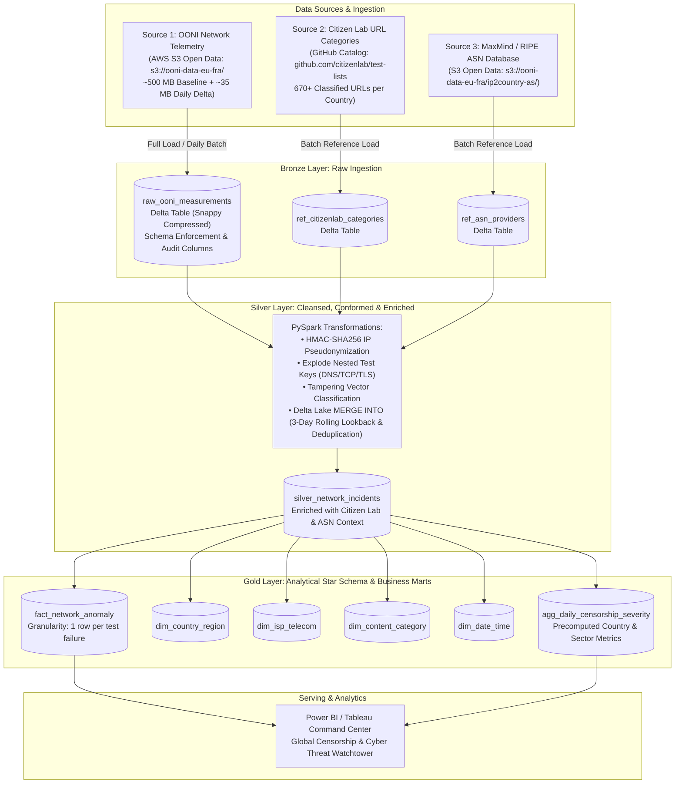
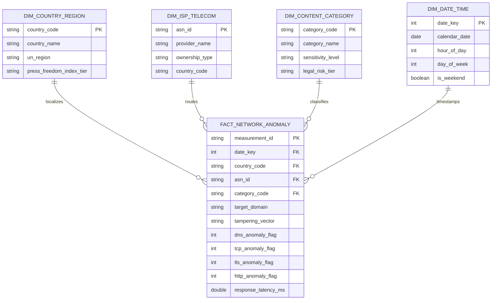

# Academic Project Proposal — Phase 1
## National University of Computer and Emerging Sciences (FAST-NUCES)
### Department of Data Science | Fall 2026
**Course**: DS3001: Design Analysis and Visualization  
**Section**: BDS-5B  
**Project Title**: Project Panopticon — Global Cyber Warfare, Internet Censorship & State Surveillance Lakehouse  

---

**Team Members**:
- **Muhammad Ibrahim** (`24L-2602`)
- **Safee Akmal** (`23L-2556`)

**Target Platform**: Apache Spark on Databricks Community Edition / Azure Cloud  
**Submission Phase**: Phase 1 Deliverables (Domain, Architecture, Governance & FinOps)  
**Submission Date**: September 27, 2026  
**GitHub Repository Link**: `https://github.com/Muhammad-Ibrahim-001/Project-Panopticon`  

---

## Executive Summary
In modern geopolitical conflict and authoritarian governance, digital communication channels are weaponized. Regimes deploy sophisticated network attacks—including Deep Packet Inspection (DPI), DNS poisoning, and TCP reset (RST) injection—to suppress independent journalism, disrupt dissident communication, and sever public access to circumvention technologies (VPNs, Tor).

**Project Panopticon** designs, implements, and evaluates an automated, end-to-end Big Data Lakehouse utilizing the **Medallion Architecture (Bronze $\rightarrow$ Silver $\rightarrow$ Gold)** powered by **Apache Spark**. The pipeline ingests multi-gigabyte streams of raw network measurement probes, cryptographically sanitizes sensitive activist telemetry under strict privacy standards, enriches network events against global threat intelligence catalogs, and surfaces actionable digital forensic insights via a high-performance Business Intelligence dashboard.

---



---

## 1. Domain & Source Identification

### 1.1 Domain Concept
The chosen domain is **Cybersecurity Forensics, Digital Human Rights, and Geopolitical Network Telemetry**. 

When civil unrest, military invasions, or controversial elections occur, state-controlled telecommunication monopolies alter national routing tables and packet inspection policies. Traditional monitoring is fragmented; non-governmental organizations (NGOs), journalists, and international regulators require automated, near-real-time digital forensics to distinguish between generic infrastructure failures and state-sponsored digital censorship.

### 1.2 Exact Data Sources & Endpoints
To construct an enterprise-grade lakehouse, our architecture ingests one primary Big Data telemetry source combined with two contextual reference sources, verified against original live production repositories:

1. **Primary Telemetry Source (Big Data Stream)**:
   * **Organization**: [Open Observatory of Network Interference (OONI)](https://ooni.org/).
   * **Direct S3 Bucket Endpoint**: AWS Open Data Registry S3 bucket **`s3://ooni-data-eu-fra/`** (Region: `eu-central-1`).
     * Direct HTTPS Gateway: `https://ooni-data-eu-fra.s3.eu-central-1.amazonaws.com/` (Public read access, no credentials required via `--no-sign-request`).
     * Partition Key Hierarchy: `jsonl/<test_name>/<probe_cc>/<YYYYMMDD>/<HH>/<filename>.jsonl.gz` (e.g., `jsonl/webconnectivity/PK/20200104/00/20200104_PK_webconnectivity.l.0.jsonl.gz`).
   * **Direct REST API Endpoint**: [OONI Measurement API](https://api.ooni.io/api/v1/measurements) (e.g., `https://api.ooni.io/api/v1/measurements?probe_cc=PK&limit=50`) and Raw Measurement Resolver (`https://api.ooni.io/api/v1/raw_measurement?measurement_uid=<uid>`).
   * **Data Format**: Semi-structured, deeply nested JSON lines compressed with gzip (`.jsonl.gz`).
   * **Payload Contents**: Deep network probe traces capturing DNS resolution queries (`queries`, `answers`, `ttl`), TCP three-way handshake attempts (`tcp_connect`), TLS cryptographic negotiation logs (`tls_handshakes`), and HTTP response headers/body blocks.

2. **Context Enrichment Source 1 (Target Classification)**:
   * **Organization**: [Citizen Lab (Munk School of Global Affairs, University of Toronto)](https://citizenlab.ca/).
   * **Access Endpoint**: [Citizen Lab Test Lists Repository](https://github.com/citizenlab/test-lists).
     * Direct Raw CSV URL: `https://raw.githubusercontent.com/citizenlab/test-lists/master/lists/<country_code>.csv` (e.g., `https://raw.githubusercontent.com/citizenlab/test-lists/master/lists/pk.csv`).
   * **Data Format**: Structured CSV files per country code (670+ classified URLs for Pakistan alone).
   * **Payload Contents**: Standardized URL mappings classified into 31 sociological categories (e.g., `NEWS`, `POLITICAL_OPPOSITION`, `CIRCUMVENTION_TOOLS`, `HUMAN_RIGHTS`, `RELIGION`).

3. **Context Enrichment Source 2 (Infrastructure Mapping)**:
   * **Organization**: MaxMind GeoLite2, IP2Location & RIPE NCC Network Coordination Centre.
   * **Access Endpoint**: Direct S3 Open Data storage under `s3://ooni-data-eu-fra/ip2country-as/` (e.g., `20180206-ip2country_as.mmdb.gz`) and public ASN directory.
   * **Data Format**: Tabular TSV/CSV and binary MMDB.
   * **Payload Contents**: Maps raw network autonomous system identifiers (e.g., `AS9541`, `AS17557`) to commercial corporate entities (e.g., *Cybernet*, *PTCL*, *Nayatel*, *Rostelecom*).

### 1.3 Ingestion Pattern: Full Load vs. Incremental Load
* **Full Load (Historical Baseline)**:
  * Ingests a continuous historical window spanning **5 to 7 consecutive days** across high-surveillance focus regions (e.g., Pakistan `PK`, Iran `IR`, Russia `RU`) during designated geopolitical disruption windows.
  * Establishes baseline normal network behavior (standard latency, baseline DNS failure rates, expected server response codes).
  * **FinOps Justification**: A full OONI country archive spans multiple years and terabytes. The 5-7 day baseline (~400–600 MB compressed, ~35K–60K records) is deliberately scoped to run within the Databricks Community Edition 15 GB RAM ceiling. This is explicitly a cost-constrained Free Tier engineering trade-off, not an architectural limitation.
* **Incremental Load (True High-Watermark + Late-Arrival Reconciliation)**:
  * The **primary incremental mechanism** is a strict **high-watermark load**: the pipeline fetches only records where `measurement_start_time > last_successful_batch_watermark`. This is CDC-compliant behavior — only net-new records are fetched on each scheduled run.
  * A **secondary late-arrival reconciliation pass** additionally reads a **3-day rolling lookback window ($T-3$ to $T$)**. This is necessary because OONI probes in authoritarian regions (Iran, Myanmar) operate on intermittent mobile networks and queue measurements locally, uploading them days after collection. The rolling window ensures these delayed records are not permanently missed.
  * These are two distinct and complementary mechanisms — not the same thing. The high-watermark fetch drives daily efficiency; the rolling lookback window provides fault-tolerance for connectivity-impaired probes.
  * Employs Delta Lake's `MERGE INTO` construct on `measurement_id`:
    1. **Late-Arriving Telemetry**: Measurements for $T-3$ uploaded today take the `WHEN NOT MATCHED INSERT` branch.
    2. **Dimensional Re-Enrichment**: `WHEN MATCHED UPDATE` updates enriched analytical fields (`content_category`, `tampering_vector`) when Citizen Lab releases updated URL category mappings.
    3. **Idempotent Recovery**: Multiple runs over the exact same date range never produce duplicate records.

---

## 2. Data Samples & Volume

### 2.1 Sample Files in Version Control
The repository maintains verified, lightweight telemetry payloads under `/data/samples/` for local testing, parsing validation, and CI/CD sanity checks:
1. `sample_full_load_ooni.json` (~222 KB): Full-fidelity JSON payload (15 heterogeneous probe runs) capturing diverse test types (`psiphon`, `echcheck`, `facebook_messenger`, `signal`, `tor`, `stunreachability`, `http_header_field_manipulation`).
2. `sample_incremental_ooni.json` (~865 KB): Multi-event JSON payload (10 probe runs) demonstrating web connectivity blocks and messaging throttling (`web_connectivity`, `whatsapp`, `telegram`).
3. `sample_citizenlab_categories.csv` (~68 KB): Complete Citizen Lab URL categorization taxonomy (670+ classified domains across 31 sociological categories).

### 2.2 Volume & Cadence Sizing (Empirically Validated)
An empirical benchmark of production OONI S3 archives reveals that raw `.jsonl.gz` files expand by **5.44x** into uncompressed JSON text, with individual measurement records averaging **17.2 KB to 90 KB** due to extensive protocol traces (`network_events`, `queries`, `tcp_connect`). 

To guarantee high-performance execution without memory exhaustion on cloud free tiers, the dataset is scoped to strategic censorship focus countries (e.g., Pakistan `PK`, Iran `IR`, Russia `RU`):

| Metric Category | Full Load Baseline (5-7 Day Focus) | Daily Incremental Load (3-Day Lookback) | Monthly Projected Volume |
| :--- | :--- | :--- | :--- |
| **Compressed S3 Archive (`.gz`)** | **~400 MB to 600 MB** | **~25 MB to 50 MB / day** | ~1.0 GB to 1.5 GB |
| **Uncompressed Raw JSON Text** | **~2.2 GB to 3.2 GB** | **~140 MB to 270 MB / day** | ~5.5 GB to 8.0 GB |
| **Record Count (Rows)** | **~35,000 to 60,000 measurements** | **~2,000 to 5,000 / day** | ~90,000 to 150,000 |
| **Delta Lake Compressed Size** | **~80 MB to 130 MB** | **~5 MB to 10 MB / day** | ~250 MB to 350 MB |
| **Ingestion Cadence** | One-time initial historical bootstrap | Daily scheduled micro-batch ($T-3$ to $T$) | Continuous scheduled cron |

### 2.3 Cloud Feasibility & Memory Safeguards (Databricks Free Tier)
* **The Databricks Community Edition Reality**:
  * **Compute Limits**: Single driver node, **0 worker nodes**, **15 GB total RAM** (~9.5 GB usable Spark JVM heap), **2 virtual cores**, and a **2 GB hard limit on DBFS web UI file uploads**.
  * Loading an uncompressed 10+ GB JSON dataset with eager schema inference would require 30–50 GB JVM heap during array explodes and wide shuffles, immediately causing `java.lang.OutOfMemoryError: Java heap space`.
* **The Verified Engineering Safeguards**:
  1. **Right-Sized Scoped Ingestion**: Scoping the baseline to ~500 MB compressed (~35k–60k deep records) provides rigorous Big Data scale while remaining comfortably inside the 9.5 GB JVM heap limit.
  2. **Direct Schema-on-Read**: Eliminates expensive schema inference passes over raw JSON by enforcing explicit PySpark `StructType` contracts.
  3. **Snappy Columnar Compression**: Persisting Bronze and Silver to Delta Lake compresses repetitive JSON keys by ~75%, reducing memory pressure during joins and shuffles.
  4. **Shuffle Partition Tuning**: Setting `spark.sql.shuffle.partitions = 16` eliminates the scheduling overhead of Spark's 200 default partitions on a 2-core node.
  5. **Partition Pruning**: Tables are physically partitioned by `measurement_date` (`PARTITIONED BY (measurement_date)`). Ingestion touches only the active lookback window partitions, leaving historical partitions untouched.

---

## 3. Security, Governance & Regulatory Compliance

### 3.1 Identification of Sensitive Telemetry & PII
A forensic audit of raw OONI network probes identifies high-risk metadata. Because probes are executed by human activists, investigative journalists, and volunteer citizens inside restrictive territories, exposure of this data poses severe legal and physical threats:
* `resolver_ip`: The public IP address of the local ISP DNS resolver (e.g., 202.163.69.18), which identifies the user's localized city and neighborhood routing infrastructure.
* `probe_ip`: Redacted upstream by OONI collectors to 127.0.0.1 for mobile safety; retained in historical/private probes.
* `probe_asn`: Autonomous System Number indicating the exact local ISP and geographic routing zone.
* `probe_city` / `probe_cc`: The localized geographic presence of the tester.
* `input`: The tested target URL, which may contain sensitive political, religious, or investigative research paths.
* **Quasi-Identifier Risk**: The combination of `probe_cc` (country) + `probe_asn` (ISP) + `target_url` + `measurement_start_time` (second precision) constitutes a **quasi-identifier** that can re-identify an individual activist even without a direct IP address. For example, if only one person in AS9541 tested `https://[dissident-blog].com` at 17:29:31 on a given day, their identity can be inferred from the combination. `probe_cc` and `probe_asn` are retained in Silver in plaintext for analytical necessity but are **never exposed at the individual record level** in Gold dashboards — Gold queries enforce minimum group sizes of ≥ 5 records per (`probe_cc`, `probe_asn`, `content_category`) combination to prevent individual re-identification.

### 3.2 High-Level Governance & Privacy Strategy
Data protection policies are enforced at the **Bronze $\rightarrow$ Silver transition boundary**; no unmasked PII is permitted into Silver or Gold analytical layers.

```text
Raw Probe IP: 198.51.100.42  ──►  1. Subnet Truncation (Zero last octet): 198.51.100.0/24
                             ──►  2. Cryptographic Salted Hash: HMAC-SHA256(198.51.100.42 + Salt)
                                  Result: e3b0c44298fc1c149afbf4c8996fb92427ae41e4649b934ca495991b7852b855
```

1. **Cryptographic Pseudonymization (HMAC-SHA256)**:
   * Client IP addresses are hashed using a salted key:
     $$\text{anonymized\_tester\_id} = \text{sha2}(\text{concat}(\text{probe\_ip}, \text{lit}(\text{ENV\_PEPPER\_SECRET})), 256)$$
   * This preserves longitudinal identity tracking (allowing the pipeline to see if the same probe observed repeated blocks) while ensuring complete one-way cryptographic protection.
2. **Subnet Masking**:
   * For non-hashed analytical operations, client IP addresses are truncated to their `/24` subnet (IPv4) or `/48` prefix (IPv6), preventing individual household identification.
3. **URL Query-String Cleansing**:
   * Target URLs are sanitized using regular expressions to strip tracking parameters, authentication tokens, and user session identifiers (`?session_id=...`, `&auth=...`) prior to Silver ingestion.
4. **GDPR / "Right to be Forgotten" Compliance**:
   * If a volunteer requests deletion of their telemetry, Delta Lake's ACID transaction capability executes partition-targeted deletion vectors:
     ```sql
     DELETE FROM silver_network_incidents WHERE anonymized_tester_id = 'target_hash';
     ```

---

## 4. High-Level Medallion Data Modeling



### 4.1 Bronze Layer (Raw Telemetry Landing)
* **Design Philosophy**: Direct, unaltered append-only ingestion of source JSON and CSV payloads.
* **Metadata Enrichment**: Spark attaches ingestion metadata columns to every record:
  * `_ingestion_timestamp`: UTC timestamp when the record reached the lakehouse.
  * `_source_file_name`: Provenance tracking back to the raw S3 bucket file.
  * `_batch_run_id`: Unique execution identifier for idempotency auditing.
* **Storage Format**: Delta Lake with default Snappy compression.

### 4.2 Silver Layer — Data Model Overview

The Silver layer flattens, conforms, and enriches raw Bronze records. The target Silver schema for `silver_network_measurements` contains the following logical column groups:

| Group | Key Columns | Source / Derivation |
| :--- | :--- | :--- |
| **Identity** | `measurement_id` (PK), `report_id`, `test_name` | `sha2(report_id \|\| input \|\| measurement_start_time)` |
| **Timing** | `measurement_timestamp` (TimestampType), `measurement_date` (DateType) | Cast from raw string with multi-format coalesce |
| **Probe** | `probe_cc`, `probe_asn_num` (LongType), `probe_network_name` | Stripped `AS` prefix → numeric cast |
| **PII-Masked** | `hashed_resolver_ip` (HMAC-SHA256), `probe_ip_subnet` (/24 truncation) | Applied at Silver boundary; raw IPs dropped |
| **Target** | `target_url`, `target_domain` (bare domain, lowercased) | `regexp_extract` from `input` field |
| **Enrichment** | `content_category`, `content_category_description` | Broadcast join with Citizen Lab CSV on `target_domain` |
| **Tampering** | `tampering_vector`, `blocking_value`, `is_accessible` | Derived from parsed `test_keys` per `test_name` |
| **Anomaly Flags** | `dns_anomaly_flag`, `tcp_anomaly_flag`, `tls_anomaly_flag`, `http_anomaly_flag` | Boolean flags from test_keys failure fields |
| **Audit** | `load_timestamp`, `_batch_id` | Pipeline execution metadata |

* **Transformations Applied**:
  1. **Schema Standardization**: `measurement_start_time` → `TimestampType` using coalesce across multiple observed OONI timestamp formats (`yyyy-MM-dd HH:mm:ss`, `yyyy-MM-dd'T'HH:mm:ss`, ISO 8601 with offset).
  2. **test_keys Parsing**: `test_keys` is stored as a raw JSON string at Bronze (see §5.1 for rationale). In Silver, it is parsed using `from_json()` with a `test_name`-specific schema, enabling correct handling of the polymorphic `blocking` field.
  3. **Citizen Lab Broadcast Join**: Joins on `target_domain` (bare domain extracted from OONI `input` field) against a similarly extracted bare domain from Citizen Lab's `url` column. Both sides are lowercased before joining.
  4. **Tampering Vector Classification**: Maps the `blocking` field value to a standard label (`BENIGN`, `DNS_MANIPULATION`, `TCP_BLOCKING`, `HTTP_BLOCKING`, `CONTENT_SUBSTITUTION`).
  5. **Deduplication**: Delta Lake `MERGE INTO` on `measurement_id` with `measurement_date` partition pruning.

### 4.3 Gold Layer (Business Marts & Dimensional Star Schema)
The Gold layer provides high-performance, analytics-ready tables modeled in a **Star Schema** optimized for analytical queries:

* **Fact Table**: `fact_network_anomaly`
  * Granularity: One row per confirmed network test failure/anomaly.
  * Foreign Keys: `date_key`, `country_code`, `asn_id`, `category_code`.
  * Measures: `dns_anomaly_flag`, `tcp_anomaly_flag`, `tls_anomaly_flag`, `response_latency_ms`.
* **Dimension Tables**:
  * `dim_country_region`: ISO country details, geopolitical region, Press Freedom Index ranking.
  * `dim_isp_telecom`: Autonomous System details, brand name, state-owned vs. private commercial classification.
  * `dim_content_category`: Citizen Lab categories (`NEWS`, `VPN`, `POLITICAL_OPPOSITION`).
  * `dim_date_time`: Date, hour, day of week, crisis period flag.
* **Aggregated Gold Mart**: `agg_daily_censorship_severity`
  * Precomputed rollups calculating the **Censorship Aggression Index (CAI)**:
    $$\text{CAI} = \left( \frac{\text{Total Tampered Tests}}{\text{Total Tests Conducted}} \right) \times 100$$
  * Sliced by `country_code`, `asn_id`, `category_code`, and `calendar_date` for instantaneous dashboard rendering.

---

## 5. Business Intelligence & Dashboards

### 5.1 Business & Forensic Questions Answered
1. **"What technical attack vector is dominant within a target country during active civil events?"**
   * Differentiates between low-cost DNS hijacking vs. enterprise-grade Deep Packet Inspection (TCP RST injection) to determine the technical sophistication of the censorship apparatus.
2. **"What content categories experience selective throttling vs. wholesale blackouts?"**
   * Proves state intentionality by contrasting failure rates of independent news and VPN portals against e-commerce and banking infrastructure.
3. **"Which telecommunication providers act as aggressive state censors vs. neutral carriers?"**
   * Identifies compliance divergence across competing commercial ISPs within the same jurisdiction.

### 5.2 Dashboard Specifications (Power BI / Tableau)

```text
┌────────────────────────────────────────────────────────────────────────────────────────────────────────┐
│  PANOPTICON: GLOBAL INTERNET CENSORSHIP & CYBER SURVEILLANCE WATCHTOWER       [Filter: Country | Date] │
├───────────────────┬────────────────────┬────────────────────────┬──────────────────────────────────────┤
│  TOTAL PROBE TESTS│ ANOMALY BLOCK RATE │ CRITICAL BLACKOUT ZONES│ DOMINANT ATTACK VECTOR               │
│       58,420      │       28.4%        │      3 COUNTRIES       │ TCP RST Injection (54.2%)            │
├───────────────────┴────────────────────┴────────────────────────┴──────────────────────────────────────┤
│  VISUAL 1: GLOBAL CENSORSHIP SEVERITY MAP                   │ VISUAL 2: ATTACK VECTOR BREAKDOWN        │
│  (Interactive Choropleth: Green = Free, Red = Severe)       │ (100% Stacked Bar: By Country & ISP)     │
│                                                             │ ┌──────────────────────────────────────┐ │
│         [ Interactive Global Map ]                          │ │ Iran Telecom:  [TCP RST][DNS][HTTP]  │ │
│   * Clicking any country cross-filters all charts below     │ │ Rostelecom:    [DPI Handshake Drop]  │ │
│                                                             │ │ Turkcell:      [DNS Tampering Only]  │ │
│                                                             │ └──────────────────────────────────────┘ │
├─────────────────────────────────────────────────────────────┴──────────────────────────────────────────┤
│  VISUAL 3: TARGET CATEGORY VULNERABILITY MATRIX             │ VISUAL 4: CENSORSHIP TIMELINE SPIKE      │
│  (What gets blocked? News vs. VPNs vs. Social Media)        │ (Hourly Anomaly % during Crisis/Protest) │
│  ┌────────────────────────────────────────────────────────┐ │ 100%│          /‾‾‾\                     │
│  │ Circumvention / VPNs:   ████████████████████  89%      │ │  50%│         /     \                    │
│  │ Independent News:       ███████████████       64%      │ │   0%│____/\__/       \______             │
│  │ Human Rights NGOs:      ██████████            42%      │ │     00:00   08:00   16:00   24:00        │
│  │ General E-Commerce:     █                      4%      │ │     ▲ Protests Begin: Signal Blocked     │
│  └────────────────────────────────────────────────────────┘ └──────────────────────────────────────────┘
└────────────────────────────────────────────────────────────────────────────────────────────────────────┘
```

#### Detailed Visual Matrix
* **Visual 1: Global Censorship Severity Map (Geospatial Choropleth)**
  * *Encoding*: Country polygons shaded by **Censorship Aggression Index (0–100%)**.
  * *Interactivity*: Serves as the primary page filter. Clicking a nation updates all child charts to that country's localized infrastructure.
* **Visual 2: Attack Vector Fingerprint Breakdown (100% Stacked Horizontal Bar)**
  * *Y-Axis*: Top 10 Monitored Telecom Providers (ISPs).
  * *X-Axis*: Proportion of observed tampering mechanisms (DNS Tampering vs. TCP Reset vs. TLS Drop vs. HTTP Block Page).
* **Visual 3: Content Category Vulnerability Matrix (Ranked Bar Chart / Heatmap)**
  * *Y-Axis*: Citizen Lab Content Taxonomy (`NEWS`, `CIRCUMVENTION_VPNS`, `POLITICAL_OPPOSITION`, `SOCIAL_MEDIA`, `ECOMMERCE`).
  * *X-Axis*: Empirical Failure Rate % ($\frac{\text{Tampered Tests}}{\text{Total Tests}} \times 100$).
* **Visual 4: Crisis Timeline & Disruption Spike Detector (Dual-Axis Area/Line Chart)**
  * *X-Axis*: Hourly timeline across a 7-day monitoring window.
  * *Y-Axis 1 (Line)*: Anomaly percentage spike.
  * *Y-Axis 2 (Bar)*: Total measurement volume (reveals total infrastructure power/cellular blackouts when test volumes plummet to zero).

---

## 6. Engineering Setup & FinOps Awareness

### 6.1 GitHub Repository Structure
The project repository is configured to maintain strict separation of concerns, test scripts, and documentation:

```text
Project-Panopticon/
├── README.md                                  # Executive lakehouse guide & project overview
├── .gitignore                                 # Git ignore rules
├── Docs/                                      # Structured documentation suite
│   ├── .docx/                                 # Formatted Word documents for academic submission
│   │   └── phase1_proposal.docx               # Executive Word Document Version
│   ├── Phase 1/                               # Phase 1: Inception & Domain Proposal
│   │   └── phase1_proposal.md                 # Formal Phase 1 Project Proposal
│   ├── Phase 2/                               # Phase 2: Ingestion, Silver & Governance
│   │   ├── phase2_implementation_plan.md      # Technical blueprint & instructor requirements
│   │   ├── 06_data_dictionary.md              # Comprehensive Bronze & Silver Data Dictionaries
│   │   └── 07_execution_guide.md              # Parameterized execution & backfill manual
│   ├── Future & Reference/                    # Architecture, Curriculum & Defense Guides
│   │   ├── 01_architectures_and_tech_stacks.md # Architecture & Cloud Trade-Off Evaluation
│   │   ├── 02_phased_implementation_and_work_division.md # Sprint Plan & Work Division
│   │   ├── 03_core_data_engineering_curriculum.md # 8 Core DE Lakehouse Superpowers
│   │   ├── 04_interview_guide_and_academic_defense.md # STAR Stories & Defense Q&A
│   │   └── 05_deployment_guide_and_troubleshooting.md # Operations Manual & OOM Mitigation
│   └── assets/                                # Visual architecture & schema artifacts
│       ├── architecture_diagram.png           # High-resolution Lakehouse Architecture
│       └── star_schema_diagram.png            # Dimensional Star Schema Entity Diagram
├── data/
│   ├── samples/                             # Version-controlled sample payloads
│   │   ├── sample_full_load_ooni.json       # Baseline probe telemetry fixture
│   │   ├── sample_incremental_ooni.json     # Incremental probe telemetry fixture
│   │   └── sample_citizenlab_categories.csv # Citizen Lab target taxonomy
│   └── schemas/                             # Explicit schema contract definitions
│       ├── bronze_ooni_schema.json          # Bronze PySpark StructType JSON contract
│       └── silver_conformed_schema.json     # Silver Conformed StructType JSON contract
└── notebooks/                               # Implementation PySpark pipelines
    ├── 00_audit_logger.py                   # Operational run logging framework
    ├── 01_bronze_ingestion.py               # Schema-on-read raw ingestion & quarantine
    ├── 02_silver_transformation.py          # PII masking, flattening & Delta MERGE
    ├── 03_gold_dimensional_modeling.py     # Analytical Star Schema & Aggregations
    └── run_pipeline.py                      # Parameterized pipeline execution runner
```

### 6.2 FinOps & Cloud Resource Optimization Strategy
Because execution is hosted on **Databricks Community Edition (1 node, 15 GB RAM, 2 vCPUs)** or **Azure for Students ($100 annual credit ceiling)**, resource management is an active engineering priority.

1. **Shuffle Partition Management**:
   * Default Apache Spark instantiates 200 shuffle partitions for joins and aggregations, which causes massive context switching and memory allocation overhead on a single-node cluster.
   * *Configuration*: Enforce `spark.conf.set("spark.sql.shuffle.partitions", "16")` to balance CPU core utilization without creating thousands of tiny in-memory task objects.
2. **Delta Lake File Compaction & Z-Ordering**:
   * Small files generated by daily streaming batches create filesystem metadata bottlenecks.
   * *Configuration*: Regularly execute automated compaction and multidimensional clustering on high-frequency query predicates:
     ```sql
     OPTIMIZE silver_network_incidents 
     ZORDER BY (country_code, measurement_date, asn_id);
     ```
3. **Storage Retention & Vacuum Policies**:
   * Unused Delta historical snapshots are pruned using `VACUUM silver_network_incidents RETAIN 7 DAYS` to prevent consuming disk quotas.
4. **Cloud Compute Lifecycle**:
   * **Databricks Community Edition**: Clusters automatically terminate after **120 minutes (2 hours) of inactivity**. This is a platform-enforced fixed policy — there is no configurable auto-termination setting on Community Edition. The engineering mitigation is to keep individual pipeline runs short (under 30 minutes) by scoping to single-country, single-test-type datasets.
   * **Azure for Students**: If running on Azure Databricks with student credits, clusters use cost-effective single-node `Standard_D4ds_v5` instances. Auto-termination **can be configured** on Azure and is set to **15 minutes of inactivity** to prevent accidental credit exhaustion. This setting is available under **Cluster Configuration → Advanced Options → Auto Termination**.

---

## Conclusion & Milestone Roadmap

| Milestone Phase | Scheduled Due Date | Core Deliverable Focus |
| :--- | :--- | :--- |
| **Phase 1** | **Submitted** | Formal Project Proposal, Sourcing, Governance, Sizing & GitHub Setup |
| **Phase 2** | **10 Oct 2026** | Automated Ingestion Engine, Bronze/Silver Delta Pipelines & PII Masking |
| **Phase 3** | **24 Oct 2026** | Gold Star Schema, Power BI Dashboard Integration & Final Project Report |
