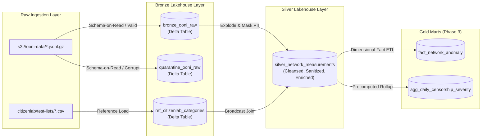

# Enterprise Data Dictionary & Schema Governance
## Project Panopticon: Global Cyber Warfare & Internet Censorship Lakehouse

---

### Document Overview
This Data Dictionary serves as the formal engineering contract and governance specification for **Project Panopticon**. It defines the schema, data types, primary keys, nullability constraints, and transformations across all layers of the **Medallion Lakehouse (Bronze $\rightarrow$ Silver $\rightarrow$ Operational Logs)**.

All ingestion pipelines and downstream analytical queries must strictly conform to the definitions herein.

---

## 1. Architectural Modeling Principles

1. **Strict Schema-on-Read**: Apache Spark schema inference (`inferSchema=True`) is strictly prohibited in production. Explicit PySpark `StructType` contracts are enforced at the raw boundary.
2. **Deterministic Primary Keys**: Telemetry records originating from distributed edge probes lack unified global auto-incrementing IDs. Deterministic surrogate keys are generated using cryptographic SHA-256 hashes of natural composite identifiers (`report_id`, `input`, and `measurement_start_time`).
3. **Immutability, Late Arrivals & Auditability**:
   - **Bronze**: Append-only raw landing table storing immutable measurements alongside lineage audit metadata (`load_timestamp`, `_source_file`, `_batch_id`).
   - **Silver**: Cleansed, PII-sanitized, and conformed table maintained via idempotent Delta Lake `MERGE INTO` (Upsert) operations. The merge reconciles a 3-day rolling lookback window ($T-3$ to $T$), inserting late-arriving measurements from offline/mobile probes (`whenNotMatchedInsertAll`) and updating enriched attributes (`content_category`, `tampering_vector`, `human_rights_risk_tier`) when taxonomy heuristics evolve (`whenMatchedUpdate`).
4. **Zero-PII Tolerance**: Raw IP addresses and session credentials must never enter Silver or Gold layers. Masking and salted hashing are applied prior to persisting Silver tables.

---

## 2. Bronze Layer Data Dictionary

### Table Name: `bronze_ooni_raw`
* **Storage Format**: Delta Lake (Snappy Compressed)
* **Physical Partitioning**: `PARTITIONED BY (measurement_date)`
* **Granularity**: One record per raw OONI network measurement probe.
* **Schema Contract**: [`data/schemas/bronze_ooni_schema.json`](../../data/schemas/bronze_ooni_schema.json)

| Column Name | PySpark Data Type | Nullable | Constraint | Source Path / Origin | Description & Business Meaning | Sample Value |
| :--- | :--- | :---: | :---: | :--- | :--- | :--- |
| `report_id` | `StringType` | No | Foreign Key | JSON `$.report_id` | Unique report identifier generated by the OONI probe collector. | `20260927T172931Z_webconnectivity_PK_9541_n1_abcdef1234` |
| `input` | `StringType` | Yes | - | JSON `$.input` | Tested network target endpoint or domain name. Null for whole-network tests (e.g., Tor, Psiphon). | `https://cloudflare-ech.com/cdn-cgi/trace` |
| `test_name` | `StringType` | No | - | JSON `$.test_name` | Protocol test classification (`web_connectivity`, `whatsapp`, `telegram`, `signal`, `tor`, `echcheck`). | `web_connectivity` |
| `measurement_start_time` | `StringType` | No | - | JSON `$.measurement_start_time` | Raw UTC timestamp string of probe execution start from collector. | `2026-09-27 17:29:31` |
| `test_start_time` | `StringType` | Yes | - | JSON `$.test_start_time` | Raw UTC timestamp string of initial probe process spawning. | `2026-09-27 17:29:30` |
| `probe_asn` | `StringType` | No | - | JSON `$.probe_asn` | Autonomous System Number of probe network with 'AS' prefix. | `AS9541` |
| `probe_cc` | `StringType` | No | ISO-3166 | JSON `$.probe_cc` | Two-letter ISO country code of testing agent location. | `PK` |
| `probe_ip` | `StringType` | Yes | Sensitive PII | JSON `$.probe_ip` | Client IP address of probe runner (often redacted upstream to `127.0.0.1` for volunteer safety). | `127.0.0.1` |
| `probe_network_name` | `StringType` | Yes | - | JSON `$.probe_network_name` | Telecommunication provider / ISP commercial brand name. | `Cyber Internet Services (Private) Limited` |
| `resolver_asn` | `StringType` | Yes | - | JSON `$.resolver_asn` | Autonomous System Number routing the local DNS resolver. | `AS9541` |
| `resolver_ip` | `StringType` | Yes | Sensitive PII | JSON `$.resolver_ip` | Local ISP DNS resolver IP address. Exposes localized city / neighborhood routing topology. | `202.163.69.18` |
| `resolver_network_name` | `StringType` | Yes | - | JSON `$.resolver_network_name` | Operating telecom network of the local DNS resolver. | `Cyber Internet Services (Private) Limited` |
| `test_runtime` | `DoubleType` | Yes | $\ge 0$ | JSON `$.test_runtime` | Total wall-clock execution time of the network test in seconds. | `4.2185` |
| `software_name` | `StringType` | Yes | - | JSON `$.software_name` | Client probe runtime engine (`ooniprobe-android`, `ooniprobe-desktop`). | `ooniprobe-android-unattended` |
| `software_version` | `StringType` | Yes | - | JSON `$.software_version` | Semantic software version of the client probe binary. | `3.30.0` |
| `test_keys` | `StructType` | Yes | Polymorphic | JSON `$.test_keys` | Deeply nested JSON payload capturing DNS answers, TCP handshakes, TLS certificates, and HTTP headers. | *See Section 2.1* |
| `load_timestamp` | `TimestampType` | No | System Audit | `current_timestamp()` | **[Audit]** Exact UTC timestamp when record was appended into Bronze Delta Lake. | `2026-09-29 14:15:02.184` |
| `_source_file` | `StringType` | No | System Audit | `input_file_name()` | **[Audit]** S3 URI or local file path from which the record was read. | `s3a://ooni-data-eu-fra/raw/20260927/PK/web.jsonl.gz` |
| `_batch_id` | `StringType` | No | System Audit | Parameter | **[Audit]** Ingestion batch identifier or execution date partition string. | `BATCH_20260927_INCREMENTAL` |
| `_corrupt_record` | `StringType` | Yes | Quarantine | Spark PERMISSIVE | **[Audit]** Contains malformed, unparseable raw JSON text when schema validation fails. | `{"bad_json": ...` |

---

### 2.1 Bronze Nested Struct: `test_keys` Structure
The polymorphic `test_keys` column captures protocol-level forensic evidence:

```text
test_keys: StructType
 ├── blocking: StringType (false, dns, tcp-reset, http-diff, http-failure)
 ├── accessible: BooleanType (true = target reachable; false = blocked)
 ├── dns_experiment_failure: StringType (dns_lookup_error, nxdomain, timeout)
 ├── http_experiment_failure: StringType (connection_refused, response_never_received)
 ├── control_failure: StringType (failure talking to un-censored OONI test helper)
 ├── queries: ArrayType
 │    └── StructType
 │         ├── failure: StringType (resolver error code)
 │         ├── query_type: StringType (A, AAAA, HTTPS)
 │         ├── resolver_hostname: StringType (DNS server address)
 │         └── answers: ArrayType
 │              └── StructType
 │                   ├── answer_type: StringType (A, CNAME)
 │                   ├── ipv4: StringType (resolved IP address)
 │                   └── ttl: LongType (DNS Time-To-Live)
 ├── tcp_connect: ArrayType
 │    └── StructType
 │         ├── ip: StringType (destination host IP)
 │         ├── port: LongType (target port: 80, 443, 853)
 │         └── status: StructType
 │              ├── failure: StringType (tcp_timed_out, connection_reset_by_peer)
 │              └── success: BooleanType
 └── tls_handshakes: ArrayType
      └── StructType
           ├── failure: StringType (ssl_invalid_hostname, certificate_revoked)
           ├── server_name: StringType (SNI host tested)
           ├── tls_version: StringType (TLSv1.2, TLSv1.3)
           └── cipher_suite: StringType (cryptographic cipher)
```

---

## 3. Reference Datasets (Context Enrichment)

### 3.1 Table Name: `ref_citizenlab_categories`
* **Source**: [Citizen Lab Test Lists](https://github.com/citizenlab/test-lists) (Munk School of Global Affairs)
* **Physical Format**: Delta Lake (Broadcastable Table $\sim 68$ KB)
* **Granularity**: One row per monitored URL.

| Column Name | PySpark Data Type | Nullable | Constraint | Description | Sample Value |
| :--- | :--- | :---: | :---: | :--- | :--- |
| `url` | `StringType` | No | Unique | Full target URL monitored for state censorship. | `https://discomaulvi.wordpress.com/` |
| `category_code` | `StringType` | No | Foreign Key | 3-5 character standard sociological category code. | `CULTR` |
| `category_description` | `StringType` | No | - | Human-readable category description. | `Culture` |
| `date_added` | `DateType` | Yes | - | Date when domain was added to Citizen Lab surveillance monitor. | `2014-04-15` |
| `source` | `StringType` | Yes | - | Contributing organization or researcher. | `citizenlab` |
| `notes` | `StringType` | Yes | - | Contextual threat intelligence or justification notes. | `Monitored for political speech suppression` |

### 3.2 Reference Taxonomy: Citizen Lab Categories & Human Rights Risk Tiers

| Category Code | Category Name | Associated Civil Risk Tier | Forensic Impact |
| :--- | :--- | :---: | :--- |
| `POL` | Political Opposition | **HIGH** | Suppression of democratic opposition and electoral candidate portals. |
| `NEWS` | Independent News Outlets | **HIGH** | State suppression of free press and independent investigative journalism. |
| `ANON` / `VPN`| Circumvention & Tor Tools | **HIGH** | Blocking VPNs, Shadowsocks, and Tor relays to isolate domestic population. |
| `HR` | Human Rights Monitors | **HIGH** | Disruption of Amnesty International, Human Rights Watch, and local NGOs. |
| `REL` | Minority Religions & Beliefs | **MEDIUM** | Sectarian or ideological state-enforced content filtering. |
| `CULTR` | Culture & Arts | **LOW** | Filtering of pop-culture, literature, or entertainment forums. |
| `COMM` | Commercial & Banking | **LOW** | Baseline economic infrastructure (used to measure collateral damage). |

---

## 4. Silver Layer Data Dictionary

### Table Name: `silver_network_measurements`
* **Storage Format**: Delta Lake (Snappy Compressed)
* **Physical Partitioning**: `PARTITIONED BY (measurement_date)`
* **Multidimensional Clustering**: `ZORDER BY (probe_cc, probe_asn, tampering_vector)`
* **Granularity**: One row per normalized network measurement probe event.
* **Schema Contract**: [`data/schemas/silver_conformed_schema.json`](../../data/schemas/silver_conformed_schema.json)

| Column Name | PySpark Data Type | Nullable | Constraint | Transformation / Lineage Logic | Description & Business Value | Sample Value |
| :--- | :--- | :---: | :---: | :--- | :--- | :--- |
| `measurement_id` | `StringType` | No | **Primary Key** | `sha2(concat_ws('\|\|', report_id, coalesce(input, 'NO_INPUT'), measurement_start_time), 256)` | Unique deterministic primary key. Enables idempotent `MERGE INTO`. | `a3b8c0...` (64-char hex) |
| `report_id` | `StringType` | No | Lineage FK | Direct from Bronze `report_id` | Provenance link back to the raw OONI telemetry report. | `20260927T172931Z_webconnectivity_PK...` |
| `event_timestamp` | `TimestampType` | No | - | `to_utc_timestamp(to_timestamp(measurement_start_time, 'yyyy-MM-dd HH:mm:ss'), 'UTC')` | Standardized UTC timestamp for time-series anomaly detection. | `2026-09-27 17:29:31.000` |
| `measurement_date` | `DateType` | No | Partition Key | `to_date(event_timestamp)` | Physical partition key. Enables partition pruning during joins. | `2026-09-27` |
| `target_url` | `StringType` | Yes | Sanitized | Regex token scrubber: strips session_id, token, auth query parameters | Tested URL with user tokens, authentication keys, and tracking IDs scrubbed. | `https://cloudflare-ech.com/cdn-cgi/trace` |
| `target_domain` | `StringType` | Yes | Join Key | `lower(regexp_extract(input, '^(?:https?://)?(?:www\.)?([^/:]+)', 1))` | Cleaned second-level domain name used for Citizen Lab broadcast joins. | `cloudflare-ech.com` |
| `probe_asn` | `LongType` | No | Numeric FK | `cast(regexp_extract(probe_asn, 'AS([0-9]+)', 1) as Long)` | Cleaned numeric Autonomous System Number (e.g., `9541`). | `9541` |
| `probe_cc` | `StringType` | No | ISO-3166 | Cleaned uppercase `trim(probe_cc)` | Two-letter ISO country code. Primary geospatial slice dimension. | `PK` |
| `probe_network_name` | `StringType` | Yes | - | Cleaned string from Bronze `probe_network_name` | Commercial ISP name operating the testing agent. | `Cyber Internet Services (Private) Limited` |
| `masked_probe_subnet`| `StringType` | Yes | Privacy Mask | `concat(split(probe_ip, '\.')[0], lit('.'), split(probe_ip, '\.')[1], lit('.'), split(probe_ip, '\.')[2], lit('.0/24'))` | Anonymized IPv4 subnet mask preventing household identification. | `192.168.1.0/24` |
| `hashed_resolver_ip` | `StringType` | Yes | PII Pseudonym | `sha2(concat(resolver_ip, lit(PEPPER_SALT)), 256)` | Salted HMAC-SHA256 hash preserving longitudinal query tracking with zero PII leakage. | `e3b0c44298fc1c149afbf4...` |
| `resolver_asn` | `LongType` | Yes | Numeric FK | `cast(regexp_extract(resolver_asn, 'AS([0-9]+)', 1) as Long)` | Numeric ASN of the local DNS resolver. | `9541` |
| `test_name` | `StringType` | No | - | Cleaned string from Bronze `test_name` | Network test type. | `web_connectivity` |
| `tampering_vector` | `StringType` | No | Categorical | Conditional classification engine (*See Section 4.1*) | Attack vector: `DNS_TAMPERING`, `TCP_RESET`, `TLS_DROP`, `HTTP_BLOCK`, `BENIGN`. | `TCP_RESET` |
| `is_anomaly` | `BooleanType` | No | Binary Flag | `tampering_vector != 'BENIGN'` | True if censorship or network interference was detected. | `true` |
| `dns_anomaly_flag` | `IntegerType` | No | Measure | `case when tampering_vector = 'DNS_TAMPERING' then 1 else 0 end` | Binary flag for Power BI sum measures. | `0` |
| `tcp_anomaly_flag` | `IntegerType` | No | Measure | `case when tampering_vector = 'TCP_RESET' then 1 else 0 end` | Binary flag for Power BI sum measures. | `1` |
| `tls_anomaly_flag` | `IntegerType` | No | Measure | `case when tampering_vector = 'TLS_DROP' then 1 else 0 end` | Binary flag for Power BI sum measures. | `0` |
| `http_anomaly_flag`| `IntegerType` | No | Measure | `case when tampering_vector = 'HTTP_BLOCK' then 1 else 0 end` | Binary flag for Power BI sum measures. | `0` |
| `dns_experiment_failure` | `StringType` | Yes | - | Direct from `test_keys.dns_experiment_failure` | DNS failure code string. | `dns_lookup_error` |
| `http_experiment_failure`| `StringType` | Yes | - | Direct from `test_keys.http_experiment_failure` | HTTP connection failure code. | `connection_refused` |
| `duration_seconds` | `DoubleType` | Yes | $\ge 0$ | Direct from Bronze `test_runtime` | Execution duration in seconds. | `4.2185` |
| `content_category` | `StringType` | No | Enrichment | Joined Citizen Lab `category_code`, default `'UNCATEGORIZED'` | Sociological content classification. | `NEWS` |
| `category_description` | `StringType` | Yes | Enrichment | Joined Citizen Lab `category_description` | Full human-readable category description. | `News Outlets` |
| `human_rights_risk_tier`| `StringType`| No | Governance | Mapped from category: `HIGH`, `MEDIUM`, `LOW` | Vulnerability assessment tier. | `HIGH` |
| `load_timestamp` | `TimestampType` | No | System Audit | `current_timestamp()` | **[Audit]** Exact UTC timestamp when record was upserted into Silver. | `2026-09-29 14:18:22.012` |
| `_batch_id` | `StringType` | No | System Audit | Passed batch parameter | **[Audit]** Ingestion execution identifier. | `BATCH_20260927_INCREMENTAL` |

---

### 4.1 Tampering Vector Classification Logic (PySpark Specification)
The `tampering_vector` column is derived through priority-ordered condition evaluation:

```python
from pyspark.sql.functions import col, when

df_classified = df.withColumn(
    "tampering_vector",
    when(
        (col("test_keys.blocking") == "dns") | 
        (col("test_keys.dns_experiment_failure").isNotNull() & (col("test_keys.control_failure").isNull())),
        "DNS_TAMPERING"
    ).when(
        (col("test_keys.blocking") == "tcp-reset") | 
        (col("test_keys.http_experiment_failure") == "connection_refused") |
        (col("test_keys.http_experiment_failure") == "connection_reset_by_peer"),
        "TCP_RESET"
    ).when(
        (col("test_keys.blocking") == "tls") | 
        (col("test_keys.http_experiment_failure").like("%ssl%") | col("test_keys.http_experiment_failure").like("%tls%")),
        "TLS_DROP"
    ).when(
        (col("test_keys.blocking") == "http-diff") | 
        (col("test_keys.blocking") == "http-failure"),
        "HTTP_BLOCK"
    ).otherwise("BENIGN")
)
```

---

## 5. Quarantine Table Data Dictionary

### Table Name: `quarantine_ooni_raw`
* **Storage Format**: Delta Lake (Snappy Compressed)
* **Retention Policy**: 30 Days (auto-vacuumed)
* **Purpose**: Isolates malformed JSON, corrupted timestamps, or schema drift violations without failing the ingestion pipeline.

| Column Name | PySpark Data Type | Nullable | Description |
| :--- | :--- | :---: | :--- |
| `quarantine_id` | `StringType` | No | Unique UUID generated upon routing (`uuid()`). |
| `quarantine_timestamp` | `TimestampType` | No | Exact UTC timestamp when record was quarantined. |
| `_source_file` | `StringType` | No | S3 URI / file path where the corrupt payload was found. |
| `_batch_id` | `StringType` | No | Ingestion batch ID. |
| `rejection_reason` | `StringType` | No | Cause: `JSON_SYNTAX_ERROR`, `NULL_PRIMARY_KEY`, `INVALID_TIMESTAMP`, `SCHEMA_DRIFT`. |
| `raw_payload` | `StringType` | Yes | Unparsed raw record text captured via `_corrupt_record`. |

---

## 6. Operational Logging Data Dictionary

### Table Name: `pipeline_execution_logs`
* **Storage Format**: Delta Lake
* **Access Mode**: Append-Only Operational Table
* **Granularity**: One record per pipeline execution stage.

| Column Name | PySpark Data Type | Nullable | Primary Key | Description & Audit Value | Sample Value |
| :--- | :--- | :---: | :---: | :--- | :--- |
| `log_id` | `StringType` | No | **PK** | Unique execution UUID generated per run (`uuid()`). | `c4b12d8a-93ef-4b47-a829-d51e70e9a3b2` |
| `pipeline_layer` | `StringType` | No | - | Execution boundary: `Raw-to-Bronze`, `Bronze-to-Silver`, `Silver-to-Gold`. | `Raw-to-Bronze` |
| `batch_parameter`| `StringType` | No | - | Target date or file parameter processed. | `2026-09-27` |
| `load_type` | `StringType` | No | - | Ingestion execution mode: `Full`, `Incremental`, `Backfill`. | `Incremental` |
| `start_time` | `TimestampType` | No | - | UTC timestamp when processing initiated. | `2026-09-29 14:15:00.000` |
| `end_time` | `TimestampType` | No | - | UTC timestamp when processing completed. | `2026-09-29 14:15:42.150` |
| `duration_seconds` | `DoubleType` | No | - | Total elapsed execution runtime in seconds. | `42.15` |
| `status` | `StringType` | No | - | Execution status: `Success`, `Failure`, `Partial_Quarantine`. | `Success` |
| `rows_read` | `LongType` | No | - | Total count of raw rows scanned from input source. | `2458920` |
| `rows_inserted` | `LongType` | No | - | Net new rows written to target Delta table. | `2458905` |
| `rows_updated` | `LongType` | No | - | Existing rows updated via Delta `MERGE INTO`. | `0` |
| `rows_quarantined`| `LongType`| No | - | Corrupt records diverted to `quarantine_ooni_raw`. | `15` |
| `error_message` | `StringType` | Yes | - | Exception stack trace if status is `Failure`. | `null` |

---

## 7. End-to-End Data Lineage & Traceability Matrix



| Source Field | Bronze Target Field | Silver Target Field | Transformation Rule |
| :--- | :--- | :--- | :--- |
| `$.report_id` | `report_id` | `report_id` | Direct mapping |
| `$.input` + `report_id` + `time` | - | `measurement_id` | `sha2(report_id \|\| input \|\| time, 256)` |
| `$.measurement_start_time` | `measurement_start_time` | `event_timestamp`, `measurement_date` | `to_utc_timestamp()`, `to_date()` |
| `$.input` | `input` | `target_url`, `target_domain` | Token scrub regex, lowercased domain extract |
| `$.resolver_ip` | `resolver_ip` | `hashed_resolver_ip` | Salted HMAC-SHA256 (`PEPPER_SALT`) |
| `$.probe_ip` | `probe_ip` | `masked_probe_subnet` | `/24` subnet truncation (`192.168.1.0/24`) |
| `$.probe_asn` | `probe_asn` | `probe_asn` | Strip `'AS'` prefix, cast to `LongType` |
| `$.test_keys` | `test_keys` (nested struct) | `tampering_vector`, `is_anomaly` | Conditional attack evaluation engine |
| `citizenlab.csv:category_code`| `ref_citizenlab_categories` | `content_category`, `risk_tier` | Broadcast join on `target_domain` |
