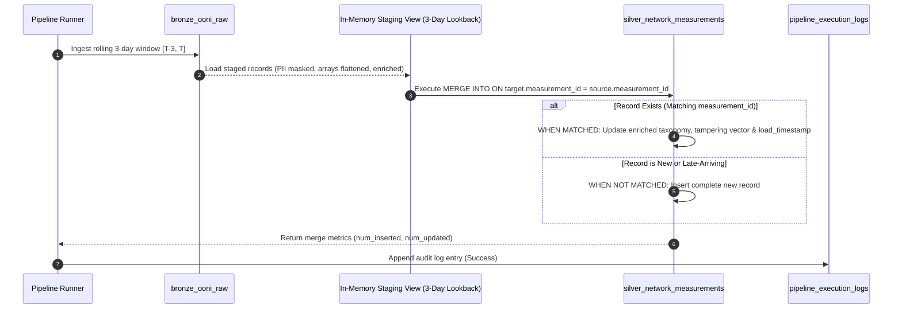

# Lakehouse Execution & Parameterized Backfill Guide
## Project Panopticon: Production Operations Runbook

---

### Executive Purpose
This guide provides data engineers, evaluators, and system operators with the exact operational instructions to execute, configure, and backfill **Project Panopticon** pipelines. 

The pipeline is built on **Apache Spark 3.5** and **Delta Lake 3.0**, engineered to run seamlessly across:
1. **Databricks Community Edition** (Interactive Notebooks with Databricks Widgets)
2. **Local Development Environment** (PySpark via standard CLI arguments)
3. **Azure Databricks** (Automated job clusters with JSON job parameters)

---

## 1. Execution Modes Overview

The pipeline strictly separates execution concerns into three operational modes via parameterized switches:

```text
                                 [Execution Trigger]
                                          │
            ┌─────────────────────────────┼─────────────────────────────┐
            ▼                             ▼                             ▼
   MODE 1: FULL BOOTSTRAP       MODE 2: INCREMENTAL BATCH     MODE 3: HISTORICAL BACKFILL
   ──────────────────────       ─────────────────────────     ───────────────────────────
   • One-time historical load   • Daily scheduled micro-batch • On-demand date range recovery
   • Reads 5-7 day baseline     • Reads yesterday's 24h delta • Reprocesses failed partitions
   • Overwrites/initializes     • Delta MERGE INTO (Upsert)   • Idempotent state reconciliation
   • Builds reference tables    • Appends operational log     • Zero duplicate records
```

| Execution Parameter | Full Load Baseline | Daily Incremental Load (3-Day Lookback) | Parameterized Backfill |
| :--- | :--- | :--- | :--- |
| `--load-type` / Widget | `full` | `incremental` | `backfill` |
| `--batch-date` / Widget| `2026-09-20` (Start Date) | Current UTC Date (e.g. `2026-09-28`) | Any Historical Date (e.g. `2026-09-22`) |
| `--lookback-days` / Widget| `0` (or full date range) | `3` (Rolling lookback $T-3$ to $T$) | `0` (Target partition only) |
| **Bronze Write Mode** | `append` (partitioned) | `append` (target date partitions) | `append` (target date partition) |
| **Silver Write Mode** | Delta `MERGE INTO` | Delta `MERGE INTO` | Delta `MERGE INTO` |
| **Audit Log Entry** | `load_type = 'Full'` | `load_type = 'Incremental'` | `load_type = 'Backfill'` |

---

## 2. Environment Setup & Prerequisites

### 2.1 Databricks Community Edition Setup ($0.00 Cost)
1. Register and log in at [https://community.cloud.databricks.com/](https://community.cloud.databricks.com/).
2. Create a single-node cluster:
   * **Runtime Version**: Databricks Runtime 14.3 LTS or 15.4 LTS (Apache Spark 3.5.0, Scala 2.12).
   * **Node Type**: Standard Free Instance (15 GB Memory, 2 Cores).
3. Under **Advanced Options** $\rightarrow$ **Spark Config**, add the mandatory memory safeguards:
   ```properties
   spark.sql.shuffle.partitions 16
   spark.databricks.delta.optimizeWrite.enabled true
   spark.databricks.delta.autoCompact.enabled true
   spark.sql.streaming.forceDeleteTempCheckpointLocation true
   ```
4. Set up the PII Pepper Salt Secret:
   ```python
   # Run once in a scratch notebook cell
   dbutils.secrets.put(scope="panopticon_vault", key="ip_salt", string="FAST_NUCES_PANOPTICON_SALT_2026")
   ```

### 2.2 Local PySpark Setup (Native / Virtual Environment)
1. Ensure **Python 3.10+** and **Java 11 or 17** (OpenJDK) are installed.
2. Install project dependencies:
   ```bash
   pip install pyspark==3.5.0 delta-spark==3.0.0 requests python-docx
   ```
3. Set your environment variable for local salt protection:
   ```bash
   # Windows PowerShell
   $env:PANOPTICON_SALT="FAST_NUCES_PANOPTICON_SALT_2026"
   
   # Linux / macOS
   export PANOPTICON_SALT="FAST_NUCES_PANOPTICON_SALT_2026"
   ```

---

## 3. Interactive Execution on Databricks

When running inside Databricks, pipeline notebooks expose GUI interactive dropdowns and text widgets (`dbutils.widgets`):

### 3.1 Parameter Widgets Configuration

```python
# Cell 1 in run_pipeline notebook
dbutils.widgets.text("batch_date", "2026-09-27", "Batch Date (YYYY-MM-DD)")
dbutils.widgets.dropdown("load_type", "incremental", ["full", "incremental", "backfill"], "Load Type")
dbutils.widgets.text("lookback_days", "3", "Lookback Days (Rolling Window)")
dbutils.widgets.text("source_dir", "s3a://ooni-data-eu-fra/jsonl/webconnectivity/PK/", "Source Data Directory")
dbutils.widgets.text("target_lakehouse", "/FileStore/tables/panopticon/", "Lakehouse Target Path")
```

### 3.2 Running the Standard Daily Incremental Run (With 3-Day Lookback)
1. Set **Batch Date**: `2026-09-28`
2. Set **Load Type**: `incremental`
3. Set **Lookback Days**: `3`
4. Click **Run All** in Databricks.
5. The runner invokes:
   - `00_audit_logger`: Creates execution run entry (`status = 'Running'`).
   - `01_bronze_ingestion`: Reads sliding window `[2026-09-25, 2026-09-28]`, validates schema, diverts corrupted records to `quarantine_ooni_raw`, and writes valid data to `bronze_ooni_raw`.
   - `02_silver_transformation`: Hashes PII, explodes protocol arrays, categorizes tampering vectors, joins Citizen Lab categories, and performs Delta `MERGE INTO`.
   - `00_audit_logger`: Finalizes entry with `rows_read`, `rows_inserted` (new & late arrivals), `rows_updated` (enrichment changes), and `status = 'Success'`.

### 3.3 Running an On-Demand Historical Backfill
If upstream OONI data for `2026-09-22` was delayed or a transformation bug was resolved:
1. Set **Batch Date**: `2026-09-22`
2. Set **Load Type**: `backfill`
3. Set **Lookback Days**: `0` (Target date only)
4. Click **Run All**.
5. The pipeline re-ingests the partition. Because Silver uses `MERGE INTO`, existing records for that date are cleanly updated with fresh transformations without creating duplicates.

---

## 4. Automated CLI Execution (Local & CI/CD)

The repository provides a standalone orchestration runner `notebooks/run_pipeline.py` for terminal execution.

### 4.1 CLI Command Syntax

```bash
python notebooks/run_pipeline.py \
    --batch-date "2026-09-27" \
    --load-type "incremental" \
    --lookback-days 3 \
    --source-dir "data/samples/" \
    --lakehouse-root "data/lakehouse/" \
    --pepper-salt "FAST_NUCES_PANOPTICON_SALT_2026"
```

### 4.2 CLI Argument Specifications

| Argument Flag | Type | Default Value | Description |
| :--- | :--- | :--- | :--- |
| `--batch-date` | `string` | Yesterday's UTC Date | Target date partition formatted as `YYYY-MM-DD`. |
| `--load-type` | `string` | `incremental` | Processing mode: `full`, `incremental`, or `backfill`. |
| `--lookback-days`| `integer`| `3` | Number of trailing days to scan to catch late-arriving measurements. |
| `--source-dir` | `string` | `data/samples/` | Input path (local directory or `s3a://ooni-data-eu-fra/jsonl/webconnectivity/PK/`). |
| `--lakehouse-root` | `string` | `data/lakehouse/` | Root path where Bronze, Silver, and Log tables reside. |
| `--pepper-salt` | `string` | From Environment | Secret pepper string used for HMAC-SHA256 IP anonymization. |
| `--max-bytes-trigger`| `string`| `512mb` | Micro-batch size boundary for JVM heap memory protection. |

---

## 5. Idempotency, Late Arrivals & Delta Lake Upsert Mechanics

### 5.1 Why Re-running Never Corrupts Data (The 3 Operational Roles of MERGE)
Raw OONI telemetry represents immutable probe event logs—upstream OONI never mutates past measurements. Consequently, Delta Lake `MERGE INTO` in Project Panopticon is engineered for three specific production purposes:

1. **Catching Late-Arriving Telemetry (Rolling 3-Day Lookback Window)**:  
   Probe devices (especially mobile clients on Android/iOS under state censorship or network blackouts) store test results offline and upload them days later. By scanning a sliding window $[T-3, T]$, previously processed records match on `measurement_id`, while newly synced late records take the `WHEN NOT MATCHED` branch and are cleanly inserted.
2. **Dimensional Re-Enrichment in Silver**:  
   While raw probe packets are immutable, the Silver layer joins with contextual threat intelligence (Citizen Lab URL taxonomy and ASN ISP registries). When Citizen Lab updates a domain's categorization (e.g., from `UNCLASSIFIED` to `CIRCUMVENTION_TOOLS`) or when tampering classification algorithms are refined, `WHEN MATCHED` updates the enriched columns without needing to re-ingest raw files.
3. **Pipeline Idempotency & Fault Recovery**:  
   If an incremental batch crashes halfway or is re-triggered after a bug fix, `MERGE INTO` updates audit columns (`load_timestamp`, `_batch_id`) without duplicating rows.



### 5.2 The Silver `MERGE INTO` SQL Pattern
```sql
MERGE INTO silver_network_measurements AS target
USING staged_silver_batch AS source
ON target.measurement_id = source.measurement_id
WHEN MATCHED AND (
    target.content_category != source.content_category OR
    target.tampering_vector != source.tampering_vector OR
    target._batch_id != source._batch_id
) THEN
  UPDATE SET
    target.event_timestamp = source.event_timestamp,
    target.tampering_vector = source.tampering_vector,
    target.is_anomaly = source.is_anomaly,
    target.dns_anomaly_flag = source.dns_anomaly_flag,
    target.tcp_anomaly_flag = source.tcp_anomaly_flag,
    target.tls_anomaly_flag = source.tls_anomaly_flag,
    target.http_anomaly_flag = source.http_anomaly_flag,
    target.content_category = source.content_category,
    target.category_description = source.category_description,
    target.human_rights_risk_tier = source.human_rights_risk_tier,
    target.load_timestamp = current_timestamp(),
    target._batch_id = source._batch_id
WHEN NOT MATCHED THEN
  INSERT *;
```

---

## 6. Schema Drift, Quarantine & Error Recovery

### 6.1 Schema Drift Strategy
When OONI releases new test types or adds keys to `test_keys`:
1. **Safe Evolution**: For new nullable root columns, the pipeline enables `.option("mergeSchema", "true")` during Delta writes.
2. **Corrupted Record Trapping**: Raw lines that fail JSON structural syntax are captured into `_corrupt_record` using Spark's `mode="PERMISSIVE"`.

### 6.2 Inspecting and Reprocessing Quarantined Rows
If corrupted records were diverted to `quarantine_ooni_raw`, inspect them via SQL:

```sql
-- View top quarantine errors for a given batch
SELECT rejection_reason, COUNT(*) as count, MIN(quarantine_timestamp) as first_seen
FROM quarantine_ooni_raw
WHERE _batch_id = 'BATCH_20260927_INCREMENTAL'
GROUP BY rejection_reason;

-- Inspect raw malformed payload
SELECT raw_payload 
FROM quarantine_ooni_raw 
WHERE rejection_reason = 'JSON_SYNTAX_ERROR' 
LIMIT 5;
```

Once the upstream format error is patched:
1. Correct the parser in `01_bronze_ingestion.py`.
2. Re-trigger the batch in `backfill` mode.

---

## 7. Operational Audit Verification Queries

After every execution, verify run health using the `pipeline_execution_logs` Delta table:

```sql
-- Check last 10 pipeline executions
SELECT 
    log_id,
    pipeline_layer,
    batch_parameter,
    load_type,
    status,
    rows_read,
    rows_inserted,
    rows_updated,
    rows_quarantined,
    duration_seconds,
    start_time
FROM pipeline_execution_logs
ORDER BY start_time DESC
LIMIT 10;
```

### Acceptance Test Checklist:
* [ ] `status` must be `'Success'` (zero uncaught exceptions).
* [ ] `rows_read` equals `rows_inserted + rows_updated + rows_quarantined`.
* [ ] In an incremental rerun of the same file: `rows_inserted` is `0`, and `rows_updated` equals `rows_read`.
* [ ] Total execution runtime on Community Edition is under 90 seconds per batch.

---

## 8. Delta Lake Storage Maintenance Protocol

Run these maintenance routines weekly or after large backfill runs to maintain high query performance in Power BI and manage storage quotas:

```sql
-- Step 1: Compact small files into optimal size & cluster by query keys
OPTIMIZE silver_network_measurements
ZORDER BY (probe_cc, probe_asn, tampering_vector);

-- Step 2: Clean up historical transaction logs and tombstoned snapshots older than 7 days
VACUUM silver_network_measurements RETAIN 168 HOURS;

-- Step 3: Optimize operational audit table
OPTIMIZE pipeline_execution_logs
ZORDER BY (start_time, pipeline_layer);
VACUUM pipeline_execution_logs RETAIN 720 HOURS;
```
