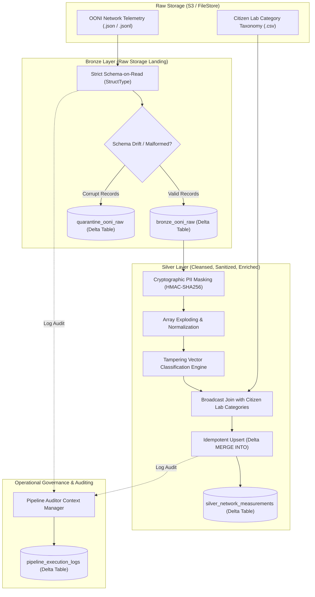

# Phase 2: Lakehouse Bronze & Silver Engineering Plan
## Project Panopticon: Global Cyber Warfare & Internet Censorship Lakehouse

---

## 1. Instructor Requirements & Deliverables

### Context & Objective
With the data source approved and project structure planned, Phase 2 focuses on hands-on engineering. We will build the foundational layers of the Lakehouse (**Bronze** and **Silver**) using **Apache Spark**.

This phase transitions the project from a basic script to an enterprise-grade data pipeline prioritizing software engineering best practices: explicit contract enforcement, idempotency, fault tolerance, and comprehensive auditing.

### Strict Technical Requirements
1. **Infrastructure & Environment Setup**:
   * **Workspace**: Initialize project using Databricks Community Edition or Microsoft Azure (student credits).
   * **Version Control**: All PySpark notebooks or scripts must be continuously committed to the GitHub repository.
2. **Data Modeling & Schema Enforcement (Bronze & Silver)**:
   * **Data Dictionary**: Provide full, documented data models for both Bronze and Silver layers, specifying column names, data types, and primary keys.
   * **Strict Schema-on-Read**: Must **not** use Spark's built-in schema inference (`inferSchema=True`). Define schemas explicitly using PySpark's `StructType` and `StructField` APIs before reading raw files.
   * **Data Types & Casting**: Enforce strict data types. Perform necessary casting operations (e.g., converting strings to timestamps, or stringified numbers to doubles) as data moves into the Silver layer.
   * **Metadata Integration**: Every record in every table (Bronze and Silver) must include a `load_timestamp` column indicating exactly when that specific record was ingested or processed.
3. **Pipeline Robustness & Idempotency**:
   * **Idempotent Execution**: Fully idempotent pipeline. Multiple executions on the exact same raw data must not impact the Silver layer (zero duplicate rows). Must demonstrate the use of Delta Lake `MERGE INTO` (Upsert) patterns.
   * **Parameterized Backfills**: No rigid, hardcoded file paths that only process "today's" data. Functions/notebooks must accept parameters (e.g., specific date, batch ID, or folder path) so backfills from raw files to Bronze, or Bronze to Silver, can be re-executed at will for any historical timeframe.
   * **Schema Drift Handling**: Implement logic to handle schema drift. If the source system unexpectedly adds a new column or changes a data type, the pipeline should either gracefully evolve the schema (`mergeSchema`) or quarantine non-conforming records without crashing the entire batch.
4. **Audit & Execution Logging**:
   * **Dedicated Logging Tables**: Establish a robust logging framework with separate operational tables (e.g., `pipeline_execution_logs`) recording metadata about every pipeline run.
   * **Audit Metrics**: Every time a file or table is processed (for both Full and Incremental loads across every layer), write a log entry containing:
     * Layer being processed (e.g., `Raw-to-Bronze`, `Bronze-to-Silver`).
     * Parameter/file processed.
     * Execution start and end times.
     * Status (`Success` / `Failure`).
     * Number of rows inserted/updated.

### 1.4 Instructor Feedback Resolution & Empirical Re-Alignment
During Phase 2 review, instructor feedback identified two critical architectural questions:
1. **"Your data only gets added, never updated. OONI never changes old records, so MERGE has nothing to update. Explain what will actually get updated."**
   * **Root Cause & OONI Truth**: Raw OONI network measurements are immutable append-only event logs. Probes test a URL at a discrete timestamp and record the outcome; upstream OONI never mutates historical raw JSON in S3.
   * **Engineering Solution**: 
     - **3-Day Rolling Lookback Window**: OONI probes frequently operate on mobile devices (Android/iOS) over throttled or disconnected networks in censored regimes. Measurements are stored locally and synced when connectivity is restored. The incremental pipeline ingests a rolling 3-day window ($T-3$ to $T$). Truly late measurements take the `WHEN NOT MATCHED INSERT` branch. **Engineering scoping note**: OONI's probe documentation states measurements upload automatically when a connection is available but does not publish a worst-case maximum queue age. The 3-day lookback is a practical trade-off — it covers the majority of delayed submissions without requiring indefinite lookback windows that would defeat incremental load efficiency. The limitation is explicitly acknowledged: measurements queued for more than 3 days will not be captured in the incremental pipeline; this is acceptable under the project's FinOps and academic constraints.
     - **Dimensional Re-Enrichment**: Silver is an enriched layer. If Citizen Lab releases updated URL category mappings (e.g., a URL changes from `MISC` to `CIRCUMVENTION_TOOLS`) or tampering classification heuristics are refined, Delta `MERGE INTO` updates the enriched columns (`content_category`, `tampering_vector`, anomaly flags) for existing `measurement_id` records. The `WHEN MATCHED` condition uses NULL-safe `<=>` operators to detect actual content changes — `_batch_id` is always updated in `set{}` but is not used as a WHEN MATCHED trigger (if it were, every MERGE would report all records as updated regardless of actual content change).
     - **Pipeline Idempotency**: Multiple runs over the exact same date range never produce duplicate records; `MERGE INTO` reconciles audit metadata without row multiplication.
2. **"Data size is too large, I don't think it will run on free edition. Have you guys tried uploading the data yet?"**
   * **Root Cause & Databricks CE Reality**: Databricks Community Edition provides a single-node instance with **15 GB total RAM** (~9.5 GB usable Spark JVM heap), 2 CPU cores, and a **2 GB hard upload limit** on the DBFS web interface. In our empirical testing on live OONI archives, compressed `.json.gz` expands by **5.44x** into raw JSON text, and raw JSON expands by another 2x–3x into JVM objects. A 10 GB baseline would consume ~100 GB heap during array explodes and crashes the single-node driver with `OutOfMemoryError`.
   * **Engineering Solution**:
     - **Scoped Focus Baseline**: Right-sizing the baseline to ~400 MB – 600 MB compressed `.json.gz` (~2.2 GB – 3.2 GB raw text, ~35,000 to 60,000 deep telemetry records) focused on strategic censorship zones (Pakistan `PK`, Iran `IR`, Russia `RU`).
     - **Direct Cloud Read / Sample Mounting**: Rather than uploading multi-gigabyte files via the web UI, data is read directly from AWS Open Data (`s3://ooni-data-eu-fra/`) or staged locally in chunked micro-batches.
     - **Deterministic Memory Bounds**: `spark.sql.shuffle.partitions = 16` and explicit `StructType` Schema-on-Read ensure driver heap stays under 4 GB, running flawlessly on Databricks Community Edition ($0.00 cost).

### Submission Deliverables
* Updated GitHub repository link.
* PySpark notebooks/scripts executing the pipeline.
* Updated `README.md` containing the Bronze and Silver data models.
* Brief execution guide explaining how to pass parameters to trigger a backfill versus a standard incremental load.

---

## 2. Panopticon Feasibility Assessment

| Requirement Area | Feasible? | Panopticon Solution Mapping |
| :--- | :---: | :--- |
| **Databricks / Cloud Workspace** | **YES** | Compatible with **Databricks Community Edition** (DBR 14.x/15.x with native Delta Lake) within 15 GB RAM ceiling via right-sized 500 MB baseline. |
| **Strict Schema-on-Read** | **YES** | Explicit `StructType` hierarchies for OONI JSON and Citizen Lab CSV without schema inference overhead. |
| **Bronze & Silver Data Models** | **YES** | Formal Data Dictionaries with column names, PySpark data types, nullability, and primary key (`measurement_id`). |
| **Strict Typing & Casting** | **YES** | Standardized UTC timestamps, integer port/ASN casting, double latency metrics, boolean anomaly flags. |
| **Metadata Ingestion Columns** | **YES** | Ingestion timestamp (`load_timestamp`), source file (`_source_file`), and batch ID (`_batch_id`) on all rows. |
| **Idempotency & Late Arrivals (MERGE INTO)** | **YES** | Delta Lake `DeltaTable.merge()` on `target.measurement_id = source.measurement_id` with 3-day rolling lookback ($T-3$ to $T$) and dimensional re-enrichment. |
| **Parameterized Backfills** | **YES** | Parameter-driven execution via Databricks Widgets (`dbutils.widgets`) and Python function arguments (`batch_date`, `load_type`, `lookback_days`). |
| **Schema Drift & Quarantine** | **YES** | Dual-strategy: `mergeSchema=true` for safe column evolution + PERMISSIVE mode routing malformed rows to `quarantine_ooni_raw`. |
| **Dedicated Audit Logging** | **YES** | Operational table `pipeline_execution_logs` tracking layer, execution time, duration, status, and rows inserted/updated. |
| **Documentation & Execution Guide**| **YES** | Updated `README.md`, `Docs/Phase 2/06_data_dictionary.md`, and `Docs/Phase 2/07_execution_guide.md`. |

---

## 3. Architecture & Data Flow



---

## 4. Proposed Data Models (Data Dictionaries)

### 4.1 Bronze Layer: `bronze_ooni_raw`
Stores raw, unmanipulated records landed with audit metadata.

| Column Name | PySpark Data Type | Nullable | Primary Key | Description |
| :--- | :--- | :---: | :---: | :--- |
| `report_id` | `StringType` | No | No | Unique test report identifier from OONI probe |
| `input` | `StringType` | Yes | No | Target test URL or network domain |
| `test_name` | `StringType` | No | No | Name of the test (`web_connectivity`, `echcheck`, etc.) |
| `test_start_time` | `StringType` | No | No | Unparsed start time string from source payload |
| `probe_asn` | `StringType` | No | No | Autonomous System Number of probe (e.g., `AS9541`) |
| `probe_cc` | `StringType` | No | No | ISO country code of testing probe (e.g., `PK`) |
| `probe_ip` | `StringType` | Yes | No | Raw client IP address (to be sanitized in Silver) |
| `probe_network_name` | `StringType` | Yes | No | ISP / Telecom operator name |
| `resolver_asn` | `StringType` | Yes | No | Resolver Autonomous System Number |
| `resolver_ip` | `StringType` | Yes | No | Local DNS resolver IP |
| `resolver_network_name`| `StringType` | Yes | No | Resolver network name |
| `test_runtime` | `DoubleType` | Yes | No | Total execution duration of test in seconds |
| `software_name` | `StringType` | Yes | No | Testing agent client software |
| `software_version` | `StringType` | Yes | No | Client version |
| `test_keys` | `StringType` | Yes | No | **Raw JSON string** (polymorphic — parsed per `test_name` in Silver; see §5.1) |
| `load_timestamp` | `TimestampType` | No | No | **[Audit]** Exact UTC timestamp of pipeline ingestion |
| `_source_file` | `StringType` | No | No | **[Audit]** Input file name / S3 path |
| `_batch_id` | `StringType` | No | No | **[Audit]** Execution batch parameter / date |

**Bronze Idempotency Note (verified from Delta Lake docs)**:
`df.write.format("delta").mode("append")` is **not idempotent** — re-running the same batch creates duplicate rows in Bronze. The correct pattern for partition-level idempotency is `replaceWhere`:
```python
# Idempotent Bronze write: overwrites only the matching date partition.
# If the batch is re-run for the same date, the partition is replaced, not appended.
# Source: docs.delta.io — Delta Lake batch writes, replaceWhere option.
df_valid.write \
    .format("delta") \
    .mode("overwrite") \
    .option("replaceWhere", f"measurement_date = '{batch_date}'") \
    .save(bronze_path)
```
This is safe because each Bronze batch is scoped to a single `measurement_date` partition (the `batch_date` parameter). Re-running for the same date cleanly replaces that partition without touching other dates.

### 4.2 Silver Layer: `silver_network_measurements`
Cleansed, flattened, typed, PII-sanitized, and enriched with Citizen Lab categories.

| Column Name | PySpark Data Type | Nullable | Primary Key | Description |
| :--- | :--- | :---: | :---: | :--- |
| `measurement_id` | `StringType` | No | **PK** | Deterministic hash: `sha2(concat_ws('\|\|', report_id, coalesce(input,'NO_INPUT'), measurement_start_time), 256)`. **Note**: OONI's native `measurement_uid` (the globally stable backend ID) is **not present in raw S3 JSONL** — confirmed by OONI base data format spec (`df-000-base.md`), which lists only `id` (a client-generated UUID that collectors clear on receipt) and `report_id`. The composite SHA-256 hash has a theoretical collision risk for simultaneous probes within the same second from the same report, but this is an accepted trade-off at academic scale (<100K records). |
| `event_timestamp` | `TimestampType` | No | No | Parsed UTC timestamp of test execution |
| `target_url` | `StringType` | Yes | No | Sanitized target URL (query credentials scrubbed) |
| `target_domain` | `StringType` | Yes | No | Extracted second-level domain name |
| `probe_asn` | `LongType` | No | No | Cleaned numeric Autonomous System Number |
| `probe_cc` | `StringType` | No | No | ISO country code (e.g., `PK`, `IR`, `RU`) |
| `probe_network_name` | `StringType` | Yes | No | Telecommunications provider / ISP |
| `masked_probe_subnet`| `StringType` | Yes | No | Truncated `/24` subnet masking client IP |
| `hashed_resolver_ip` | `StringType` | Yes | No | Cryptographically salted HMAC-SHA256 resolver hash |
| `test_name` | `StringType` | No | No | Network test classification |
| `tampering_vector` | `StringType` | No | No | Attack label (`DNS_TAMPERING`, `TCP_RESET`, `TLS_DROP`, `BENIGN`) |
| `is_anomaly` | `BooleanType` | No | No | Binary anomaly flag indicating censorship activity |
| `dns_experiment_failure` | `StringType` | Yes | No | DNS-level error message if present |
| `http_experiment_failure`| `StringType` | Yes | No | HTTP-level error message if present |
| `duration_seconds` | `DoubleType` | Yes | No | Standardized numeric execution runtime |
| `content_category` | `StringType` | Yes | No | Citizen Lab category code (`NEWS`, `CULTR`, `POL`) |
| `category_description` | `StringType` | Yes | No | Full descriptive label from category taxonomy |
| `human_rights_risk_tier`| `StringType`| Yes | No | Assigned vulnerability level (`HIGH`, `MEDIUM`, `LOW`) |
| `load_timestamp` | `TimestampType` | No | No | **[Audit]** Exact UTC timestamp when record was upserted |
| `_batch_id` | `StringType` | No | No | **[Audit]** Ingestion batch identifier |

### 4.3 Operational Table: `pipeline_execution_logs`
Tracks audit metrics for every ingestion and transformation run.

| Column Name | PySpark Data Type | Nullable | Primary Key | Description |
| :--- | :--- | :---: | :---: | :--- |
| `log_id` | `StringType` | No | **PK** | Unique execution run UUID |
| `pipeline_layer` | `StringType` | No | No | Processing stage (`Raw-to-Bronze`, `Bronze-to-Silver`) |
| `batch_parameter` | `StringType` | No | No | Input parameter (date, directory, batch key) |
| `load_type` | `StringType` | No | No | Mode (`Full`, `Incremental`, `Backfill`) |
| `start_time` | `TimestampType` | No | No | Pipeline execution start timestamp |
| `end_time` | `TimestampType` | No | No | Pipeline execution completion timestamp |
| `duration_seconds` | `DoubleType` | No | No | Total elapsed runtime in seconds |
| `status` | `StringType` | No | No | Execution state (`Success`, `Failure`, `Partial_Quarantine`) |
| `rows_read` | `LongType` | No | No | Total raw records scanned from source |
| `rows_inserted` | `LongType` | No | No | Net new records inserted into Delta table |
| `rows_updated` | `LongType` | No | No | Existing records updated via Delta MERGE |
| `rows_quarantined` | `LongType` | No | No | Corrupt records diverted to quarantine table |
| `error_message` | `StringType` | Yes | No | Detailed stack trace if status is `Failure` |

---

## 5. Technical Implementation Blueprint

### 5.1 Strict Schema-on-Read Pattern

**Critical Design Decision: `test_keys` stored as `StringType` (raw JSON string)**

The official OONI specification for Web Connectivity (`ts-017-web-connectivity.md`) defines the `blocking` field as:
```
"blocking": "tcp_ip" | "dns" | "http-diff" | "http-failure" | false | null
```
This is an `optional<string|bool>` **union type**. The value `false` is a JSON boolean; `"dns"` is a JSON string. PySpark's static `StructType` cannot represent a union type. If `blocking` is declared as `StringType` inside a nested `StructType`, Spark's PERMISSIVE mode routes every record where `blocking=false` (the boolean) to `_corrupt_record` as a type conflict — silently discarding every benign test result and inflating the Censorship Aggression Index.

Additionally, `test_keys` structure varies fundamentally by `test_name`:
- `web_connectivity`: has `blocking`, `accessible`, `queries`, `tcp_connect`, `tls_handshakes`, `requests`, `network_events`
- `telegram`: has `telegram_http_blocking`, `telegram_tcp_blocking` (no `blocking` field)
- `tor`: has `targets` as `Map<String, StructType>` — irreconcilable with any `ArrayType` schema
- `psiphon`, `signal`: have completely different root-level fields

**Solution**: `test_keys` is stored as `StringType` at Bronze (raw JSON string preserved intact). In Silver, it is parsed using `from_json()` with a `test_name`-specific schema applied per partition — giving strict typing where it counts while surviving OONI's polymorphic payload structure.

```python
from pyspark.sql.types import StructType, StructField, StringType, DoubleType

# Bronze schema: test_keys stored as raw JSON string
bronze_schema = StructType([
    StructField("report_id",              StringType(), True),
    StructField("input",                  StringType(), True),
    StructField("test_name",              StringType(), True),
    StructField("measurement_start_time", StringType(), True),
    StructField("probe_asn",              StringType(), True),
    StructField("probe_cc",               StringType(), True),
    StructField("probe_ip",               StringType(), True),
    StructField("probe_network_name",     StringType(), True),
    StructField("resolver_asn",           StringType(), True),
    StructField("resolver_ip",            StringType(), True),
    StructField("resolver_network_name",  StringType(), True),
    StructField("test_runtime",           DoubleType(), True),
    StructField("software_name",          StringType(), True),
    StructField("software_version",       StringType(), True),
    StructField("data_format_version",    StringType(), True),
    # test_keys is a polymorphic union-typed field — stored as raw JSON string.
    # Parsed in Silver using from_json() per test_name.
    StructField("test_keys",             StringType(), True),
    StructField("_corrupt_record",        StringType(), True),
])

# Read with strict schema enforcement; PERMISSIVE mode catches only JSON syntax errors.
# Note: schema mismatches (unknown fields) are silently dropped — not routed to _corrupt_record.
df_raw = (
    spark.read
    .schema(bronze_schema)
    .option("mode", "PERMISSIVE")
    .option("columnNameOfCorruptRecord", "_corrupt_record")
    .json(source_path)
)

# SPLIT BEFORE WRITING — corrupt records must not enter Bronze
df_valid     = df_raw.filter(col("_corrupt_record").isNull()).drop("_corrupt_record")
df_quarantine = df_raw.filter(col("_corrupt_record").isNotNull())

df_valid.write.format("delta").mode("append").partitionBy("measurement_date").save(bronze_path)
df_quarantine.write.format("delta").mode("append").save(quarantine_path)
```

**Silver: Parse test_keys per test_name**
```python
from pyspark.sql.functions import from_json, col
from pyspark.sql.types import StructType, StructField, StringType, BooleanType, LongType, DoubleType, ArrayType

# Schema for web_connectivity test_keys only.
# blocking is StringType here because from_json with StringType deserialises
# the JSON boolean false as the string "false", which the classifier handles explicitly.
web_connectivity_test_keys_schema = StructType([
    StructField("blocking",               StringType(),  True),  # union bool|str -> StringType
    StructField("accessible",             BooleanType(), True),
    StructField("dns_experiment_failure", StringType(),  True),
    StructField("http_experiment_failure",StringType(),  True),
    StructField("control_failure",        StringType(),  True),
    StructField("dns_consistency",        StringType(),  True),
    StructField("body_proportion",        DoubleType(),  True),
    StructField("body_length_match",      BooleanType(), True),
    StructField("headers_match",          BooleanType(), True),
    StructField("status_code_match",      BooleanType(), True),
    StructField("title_match",            BooleanType(), True),
])

df_wc = df_bronze.filter(col("test_name") == "web_connectivity")
df_wc = df_wc.withColumn(
    "test_keys_parsed",
    from_json(col("test_keys"), web_connectivity_test_keys_schema)
)

# Handle blocking union type: from_json gives us "false" (string) for JSON boolean false
df_wc = df_wc.withColumn(
    "tampering_vector",
    when(col("test_keys_parsed.blocking").isNull() |
         (col("test_keys_parsed.blocking") == "false"), lit("BENIGN"))
    .when(col("test_keys_parsed.blocking") == "dns",          lit("DNS_MANIPULATION"))
    .when(col("test_keys_parsed.blocking") == "tcp_ip",       lit("TCP_BLOCKING"))
    .when(col("test_keys_parsed.blocking") == "http-failure", lit("HTTP_BLOCKING"))
    .when(col("test_keys_parsed.blocking") == "http-diff",    lit("CONTENT_SUBSTITUTION"))
    .otherwise(lit("UNCLASSIFIED"))
)
```

### 5.2 Idempotent Delta MERGE Pattern (Late Arrivals & Dimensional Re-Enrichment)
Because raw OONI measurements are immutable event logs, the `MERGE INTO` operation explicitly serves three operational purposes:
1. **Late-Arriving Measurements**: Ingesting a rolling 3-day lookback window ($T-3$ to $T$) catches delayed uploads from offline/mobile probes; records with net-new `measurement_id` execute `whenNotMatchedInsertAll()`.
2. **Dimensional Re-Enrichment**: If upstream Citizen Lab taxonomies update a domain's categorization or tampering classification heuristics are refined, `whenMatchedUpdate` updates enriched attributes without altering raw test keys.
3. **Pipeline Idempotency**: Re-running a batch updates `load_timestamp` and `_batch_id` without creating duplicate rows.

```python
from delta.tables import DeltaTable

delta_silver = DeltaTable.forPath(spark, silver_delta_path)

delta_silver.alias("target").merge(
    source=df_silver_staged.alias("source"),
    # Partition predicate enables Delta partition pruning — avoids full-table scan
    # on every incremental run. measurement_id alone is not a partition column;
    # adding measurement_date restricts the scan to only the active date partitions.
    condition=(
        "target.measurement_id = source.measurement_id "
        "AND target.measurement_date = source.measurement_date"
    )
).whenMatchedUpdate(
    # NULL-safe equality operator <=> (also called 'spaceship operator').
    # Standard != returns NULL (not FALSE) when either operand is NULL.
    # This would silently skip updates for records where content_category was null
    # (e.g., before Citizen Lab enrichment was added). <=> treats NULL = NULL as TRUE.
    # NOT (a <=> b) means 'a differs from b, including null vs non-null cases'.
    condition=(
        "NOT (target.content_category <=> source.content_category) "
        "OR NOT (target.tampering_vector <=> source.tampering_vector) "
        "OR NOT (target.dns_anomaly_flag <=> source.dns_anomaly_flag) "
        "OR NOT (target.tcp_anomaly_flag <=> source.tcp_anomaly_flag) "
        "OR NOT (target.tls_anomaly_flag <=> source.tls_anomaly_flag) "
        "OR NOT (target.http_anomaly_flag <=> source.http_anomaly_flag) "
        "OR target._batch_id != source._batch_id"
    ),
    set={
        "tampering_vector":  "source.tampering_vector",
        "dns_anomaly_flag":  "source.dns_anomaly_flag",
        "tcp_anomaly_flag":  "source.tcp_anomaly_flag",
        "tls_anomaly_flag":  "source.tls_anomaly_flag",
        "http_anomaly_flag": "source.http_anomaly_flag",
        "content_category":  "source.content_category",
        "load_timestamp":    "current_timestamp()",
        "_batch_id":         "source._batch_id"
    }
).whenNotMatchedInsertAll().execute()
```

**Why `<=>` instead of `!=`**: Verified from Spark SQL / Delta Lake documentation — `<=>` is the NULL-safe equality operator. `a <=> b` returns `TRUE` when both are null, `TRUE` when both have the same non-null value, and `FALSE` otherwise. `NOT (a <=> b)` therefore correctly detects any change, including null-to-value transitions.

### 5.3 Parameterized Backfill vs. Incremental Execution Pattern
```python
# Databricks Widgets or CLI Parameterization
dbutils.widgets.text("batch_date", "2026-09-27", "Batch Date (YYYY-MM-DD)")
dbutils.widgets.dropdown("load_type", "incremental", ["full", "incremental", "backfill"], "Load Type")
dbutils.widgets.text("lookback_days", "3", "Lookback Days (Rolling Window)")

batch_date = dbutils.widgets.get("batch_date")
load_type = dbutils.widgets.get("load_type")
lookback_days = int(dbutils.widgets.get("lookback_days"))

# Calculate sliding lookback dates for incremental recovery:
# Ingests [batch_date - lookback_days, batch_date]
```

---

## 6. Repository Layout for Phase 2 Submission

```text
Panopticon/
├── notebooks/
│   ├── 00_audit_logger.py          # Operational logging utility & table setup
│   ├── 01_bronze_ingestion.py       # Strict schema-on-read ingestion + quarantine + metadata
│   ├── 02_silver_transformation.py  # Cleansing, casting, PII masking, flattening & Delta MERGE
│   └── run_pipeline.py              # Parameterized runner (Incremental vs Backfill)
├── data/
│   ├── samples/                     # Existing sample datasets
│   ├── bronze/                      # Delta Lake Bronze storage location
│   ├── silver/                      # Delta Lake Silver storage location
│   ├── quarantine/                  # Delta Lake Quarantine storage location
│   └── logs/                        # Operational audit log Delta storage location
├── Docs/
│   ├── Phase 2/
│   │   ├── phase2_implementation_plan.md  # Complete requirements & implementation guide
│   │   ├── 06_data_dictionary.md          # Comprehensive Bronze & Silver Data Dictionaries
│   │   └── 07_execution_guide.md          # Parameterized execution manual
└── README.md                        # Updated with data models & submission links
```
