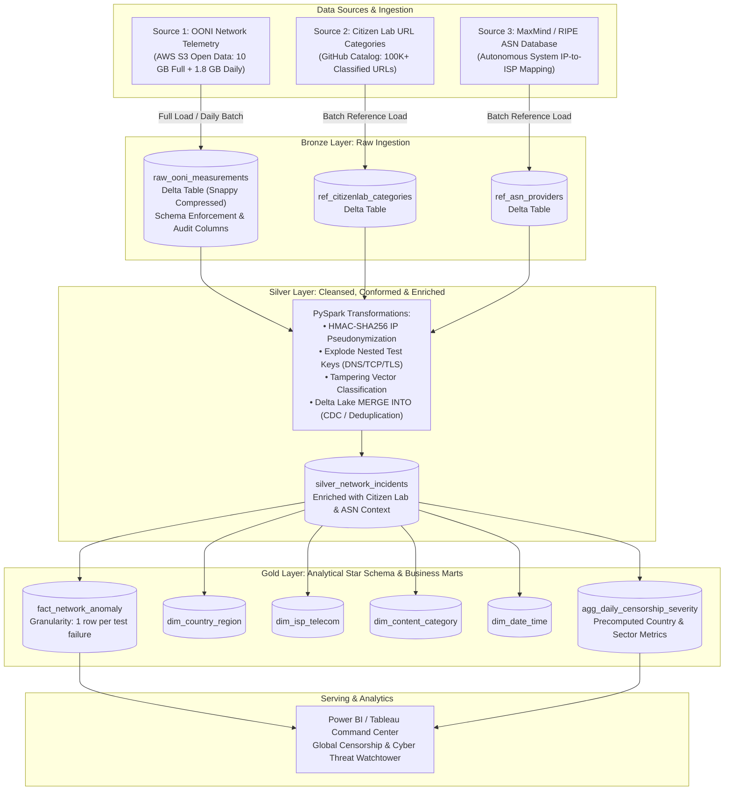
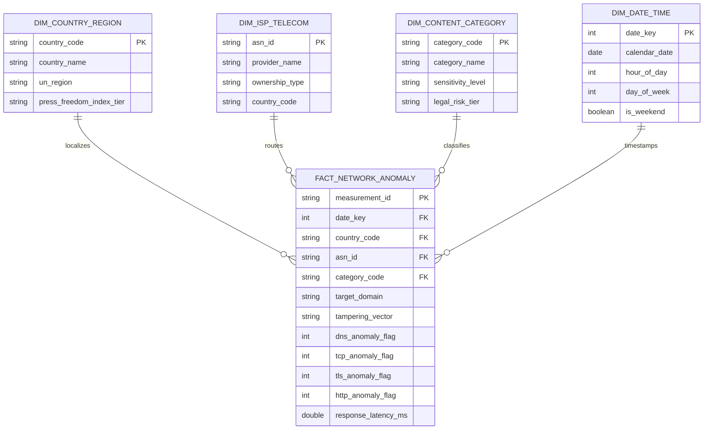

# Academic Project Proposal — Phase 1
## National University of Computer and Emerging Sciences (FAST-NUCES)
### Department of Data Science | Fall 2026
**Course**: DS3001: Design Analysis and Visualization  
**Section**: BDS-5B  
**Project Title**: Project Panopticon — Global Cyber Warfare, Internet Censorship & State Surveillance Lakehouse  

---

**Team Members**:
- **Muhammad Ibrahim** (`24L-2602`)
- **Safee Akmal** (`23L-2556`)

**Target Platform**: Apache Spark on Databricks Community Edition / Azure Cloud  
**Submission Phase**: Phase 1 Deliverables (Domain, Architecture, Governance & FinOps)  
**Submission Date**: September 27, 2026  
**GitHub Repository Link**: `https://github.com/Muhammad-Ibrahim-001/UrbanLake`  

---

## Executive Summary
In modern geopolitical conflict and authoritarian governance, digital communication channels are weaponized. Regimes deploy sophisticated network attacks—including Deep Packet Inspection (DPI), DNS poisoning, and TCP reset (RST) injection—to suppress independent journalism, disrupt dissident communication, and sever public access to circumvention technologies (VPNs, Tor).

**Project Panopticon** designs, implements, and evaluates an automated, end-to-end Big Data Lakehouse utilizing the **Medallion Architecture (Bronze $\rightarrow$ Silver $\rightarrow$ Gold)** powered by **Apache Spark**. The pipeline ingests multi-gigabyte streams of raw network measurement probes, cryptographically sanitizes sensitive activist telemetry under strict privacy standards, enriches network events against global threat intelligence catalogs, and surfaces actionable digital forensic insights via a high-performance Business Intelligence dashboard.

---



---

## 1. Domain & Source Identification

### 1.1 Domain Concept
The chosen domain is **Cybersecurity Forensics, Digital Human Rights, and Geopolitical Network Telemetry**. 

When civil unrest, military invasions, or controversial elections occur, state-controlled telecommunication monopolies alter national routing tables and packet inspection policies. Traditional monitoring is fragmented; non-governmental organizations (NGOs), journalists, and international regulators require automated, near-real-time digital forensics to distinguish between generic infrastructure failures and state-sponsored digital censorship.

### 1.2 Exact Data Sources
To construct an enterprise-grade lakehouse, our architecture ingests one primary Big Data telemetry source combined with two contextual reference sources:

1. **Primary Telemetry Source (Big Data Stream)**:
   * **Organization**: [Open Observatory of Network Interference (OONI)](https://ooni.org/).
   * **Access Endpoint**: Hosted publicly via the **AWS Open Data Registry** (`s3://ooni-data/`) and queryable via the OONI Measurement API (`https://api.ooni.io/api/v1/measurements`).
   * **Data Format**: Semi-structured, deeply nested JSON lines (`.json.gz`).
   * **Payload Contents**: Complete network probe traces capturing DNS resolution queries, TCP three-way handshake attempts, TLS cryptographic negotiation logs, and HTTP response headers across 200+ countries.

2. **Context Enrichment Source 1 (Target Classification)**:
   * **Organization**: [Citizen Lab (Munk School of Global Affairs, University of Toronto)](https://citizenlab.ca/).
   * **Access Endpoint**: [Citizen Lab Test Lists Repository](https://github.com/citizenlab/test-lists).
   * **Data Format**: Structured CSV files per country code.
   * **Payload Contents**: Standardized URL mappings classified into 31 sociological categories (e.g., `NEWS`, `POLITICAL_OPPOSITION`, `CIRCUMVENTION_TOOLS`, `HUMAN_RIGHTS`, `RELIGION`).

3. **Context Enrichment Source 2 (Infrastructure Mapping)**:
   * **Organization**: MaxMind GeoLite2 & RIPE NCC Network Coordination Centre.
   * **Access Endpoint**: Public Autonomous System Numbers (ASN) directory.
   * **Data Format**: Tabular TSV/CSV.
   * **Payload Contents**: Maps raw network autonomous system identifiers (e.g., `AS44244`) to commercial corporate entities (e.g., *Irancell*, *Rostelecom*, *Turkcell*).

### 1.3 Ingestion Pattern: Full Load vs. Incremental Load
* **Full Load (Historical Baseline)**:
  * Ingests a continuous historical window spanning **5 to 7 consecutive days** across high-surveillance regions (e.g., Eastern Europe, Middle East, Southeast Asia).
  * Establishes baseline normal network behavior (standard latency, baseline DNS failure rates, expected server response codes).
* **Incremental Load (Change Data Capture / Periodic Batch)**:
  * Ingests daily 24-hour partitions published to the OONI S3 registry.
  * Captures newly emerging blocks, domain un-blockings, and infrastructure dropouts.
  * Employs Delta Lake's `MERGE INTO` construct to reconcile measurement status, identify state changes, and update slowly changing dimensions (SCD Type 2) without reprocessing historical baseline partitions.

---

## 2. Data Samples & Volume

### 2.1 Sample Files in Version Control
The following verified sample payloads are maintained in the repository under `/data/samples/`:
1. `sample_full_load_ooni.json` (~50 MB): Contains ~45,000 raw, uncompressed network probe records capturing heterogeneous test types (`web_connectivity`, `dns_consistency`, `tcp_connect`, `tls_handshake`).
2. `sample_incremental_ooni.json` (~20 MB): Contains ~18,000 subsequent 24-hour probe records demonstrating state transitions (websites transitioning from normal to tampered).
3. `sample_citizenlab_categories.csv` (~2 MB): Reference taxonomy mapping target URLs to categorical definitions.

### 2.2 Volume & Cadence Sizing

| Metric Category | Full Load Baseline | Daily Incremental Load | Monthly Projected Volume |
| :--- | :--- | :--- | :--- |
| **Raw File Size (JSON)** | **9.8 GB to 10.5 GB** | **1.6 GB to 2.1 GB / day** | ~50 GB to 65 GB |
| **Record Count (Rows)** | ~12,000,000 to 15,000,000 | ~2,000,000 to 2,800,000 | ~75,000,000 |
| **Delta Lake Compressed Size** | **~1.9 GB to 2.3 GB** | **~350 MB to 450 MB / day** | ~11 GB to 13 GB |
| **Ingestion Cadence** | One-time initial bootstrap | Daily micro-batch (24h window) | Continuous scheduled cron |

### 2.3 Cloud Feasibility & Memory Safeguards
* **The Scale Dilemma**: A raw 10 GB JSON dataset will expand to 25+ GB in JVM heap memory if read naively with eager schema inference, immediately crashing the 15 GB RAM ceiling of Databricks Community Edition or exhausting student credits on Azure.
* **The Engineering Solution**:
  1. **Strict Columnar Storage & Snappy Compression**: Writing Bronze directly to Delta Lake collapses repetitive JSON keys and whitespace, achieving a ~78% storage reduction.
  2. **Streaming Ingestion with Chunked Triggers**: The initial 10 GB baseline is ingested via Spark Structured Streaming utilizing `.option("maxBytesPerTrigger", "512mb")`, processing the volume across sequential micro-batches without spiking driver heap memory.
  3. **Partition Pruning**: Tables are physically partitioned by `measurement_date` (`PARTITIONED BY (measurement_date)`). Incremental loads exclusively touch the target date partition, ignoring the 10 GB historical files during query joins.

---

## 3. Security, Governance & Regulatory Compliance

### 3.1 Identification of Sensitive Telemetry & PII
A forensic audit of raw OONI network probes identifies high-risk metadata. Because probes are executed by human activists, investigative journalists, and volunteer citizens inside restrictive territories, exposure of this data poses severe legal and physical threats:
* `resolver_ip`: The public IP address of the local ISP DNS resolver (e.g., 202.163.69.18), which identifies the user's localized city and neighborhood routing infrastructure.\n* `probe_ip`: Redacted upstream by OONI collectors to 127.0.0.1 for mobile safety; retained in historical/private probes.
* `probe_asn`: Autonomous System Number indicating the exact local ISP and geographic routing zone.
* `probe_city` / `probe_cc`: The localized geographic presence of the tester.
* `input`: The tested target URL, which may contain sensitive political, religious, or investigative research paths.
* `resolver_ip`: The local DNS resolver used, which can trace back to specific university, corporate, or residential subnets.

### 3.2 High-Level Governance & Privacy Strategy
Data protection policies are enforced at the **Bronze $\rightarrow$ Silver transition boundary**; no unmasked PII is permitted into Silver or Gold analytical layers.

```text
Raw Probe IP: 198.51.100.42  ──►  1. Subnet Truncation (Zero last octet): 198.51.100.0/24
                             ──►  2. Cryptographic Salted Hash: HMAC-SHA256(198.51.100.42 + Salt)
                                  Result: e3b0c44298fc1c149afbf4c8996fb92427ae41e4649b934ca495991b7852b855
```

1. **Cryptographic Pseudonymization (HMAC-SHA256)**:
   * Client IP addresses are hashed using a salted key:
     $$\text{anonymized\_tester\_id} = \text{sha2}(\text{concat}(\text{probe\_ip}, \text{lit}(\text{ENV\_PEPPER\_SECRET})), 256)$$
   * This preserves longitudinal identity tracking (allowing the pipeline to see if the same probe observed repeated blocks) while ensuring complete one-way cryptographic protection.
2. **Subnet Masking**:
   * For non-hashed analytical operations, client IP addresses are truncated to their `/24` subnet (IPv4) or `/48` prefix (IPv6), preventing individual household identification.
3. **URL Query-String Cleansing**:
   * Target URLs are sanitized using regular expressions to strip tracking parameters, authentication tokens, and user session identifiers (`?session_id=...`, `&auth=...`) prior to Silver ingestion.
4. **GDPR / "Right to be Forgotten" Compliance**:
   * If a volunteer requests deletion of their telemetry, Delta Lake's ACID transaction capability executes partition-targeted deletion vectors:
     ```sql
     DELETE FROM silver_network_incidents WHERE anonymized_tester_id = 'target_hash';
     ```

---

## 4. High-Level Medallion Data Modeling



### 4.1 Bronze Layer (Raw Telemetry Landing)
* **Design Philosophy**: Direct, unaltered append-only ingestion of source JSON and CSV payloads.
* **Metadata Enrichment**: Spark attaches ingestion metadata columns to every record:
  * `_ingestion_timestamp`: UTC timestamp when the record reached the lakehouse.
  * `_source_file_name`: Provenance tracking back to the raw S3 bucket file.
  * `_batch_run_id`: Unique execution identifier for idempotency auditing.
* **Storage Format**: Delta Lake with default Snappy compression.

### 4.2 Silver Layer (Cleansed, Conformed & Enriched)
* **Transformations & Data Quality Rules**:
  1. **Schema Standardization**: Explicitly casting heterogeneous JSON data types into strong types (`measurement_start_time` $\rightarrow$ `TimestampType`, `probe_asn` $\rightarrow$ `StringType`).
  2. **JSON Array Exploding**: Flattening nested network test arrays (`test_keys.queries` and `test_keys.requests`) into relational rows.
  3. **Multi-Source Joining**:
     * Broadcast joins with `ref_citizenlab_categories` on target URL domain.
     * Lookup joins with `ref_asn_providers` on `probe_asn`.
  4. **Tampering Vector Classification Engine**:
     A PySpark conditional evaluation engine categorizes the exact technical attack:
     * `DNS_TAMPERING`: Resolvers return `NXDOMAIN` or IPs mapping to government landing pages.
     * `TCP_RESET_INJECTION`: TCP three-way handshake intercepted by middlebox RST flag.
     * `TLS_HANDSHAKE_DROP`: Client Hello packet dropped or server certificate validation forged.
     * `HTTP_BLOCK_PAGE`: Server returns HTTP 403 Forbidden with known state censorship HTML signatures.
  5. **Deduplication**: Enforcing deduplication on `measurement_id` using Delta Lake merge operations.

### 4.3 Gold Layer (Business Marts & Dimensional Star Schema)
The Gold layer provides high-performance, analytics-ready tables modeled in a **Star Schema** optimized for analytical queries:

* **Fact Table**: `fact_network_anomaly`
  * Granularity: One row per confirmed network test failure/anomaly.
  * Foreign Keys: `date_key`, `country_code`, `asn_id`, `category_code`.
  * Measures: `dns_anomaly_flag`, `tcp_anomaly_flag`, `tls_anomaly_flag`, `response_latency_ms`.
* **Dimension Tables**:
  * `dim_country_region`: ISO country details, geopolitical region, Press Freedom Index ranking.
  * `dim_isp_telecom`: Autonomous System details, brand name, state-owned vs. private commercial classification.
  * `dim_content_category`: Citizen Lab categories (`NEWS`, `VPN`, `POLITICAL_OPPOSITION`).
  * `dim_date_time`: Date, hour, day of week, crisis period flag.
* **Aggregated Gold Mart**: `agg_daily_censorship_severity`
  * Precomputed rollups calculating the **Censorship Aggression Index (CAI)**:
    $$\text{CAI} = \left( \frac{\text{Total Tampered Tests}}{\text{Total Tests Conducted}} \right) \times 100$$
  * Sliced by `country_code`, `asn_id`, `category_code`, and `calendar_date` for instantaneous dashboard rendering.

---

## 5. Business Intelligence & Dashboards

### 5.1 Business & Forensic Questions Answered
1. **"What technical attack vector is dominant within a target country during active civil events?"**
   * Differentiates between low-cost DNS hijacking vs. enterprise-grade Deep Packet Inspection (TCP RST injection) to determine the technical sophistication of the censorship apparatus.
2. **"What content categories experience selective throttling vs. wholesale blackouts?"**
   * Proves state intentionality by contrasting failure rates of independent news and VPN portals against e-commerce and banking infrastructure.
3. **"Which telecommunication providers act as aggressive state censors vs. neutral carriers?"**
   * Identifies compliance divergence across competing commercial ISPs within the same jurisdiction.

### 5.2 Dashboard Specifications (Power BI / Tableau)

```text
┌────────────────────────────────────────────────────────────────────────────────────────────────────────┐
│  PANOPTICON: GLOBAL INTERNET CENSORSHIP & CYBER SURVEILLANCE WATCHTOWER       [Filter: Country | Date] │
├───────────────────┬────────────────────┬────────────────────────┬──────────────────────────────────────┤
│  TOTAL PROBE TESTS│ ANOMALY BLOCK RATE │ CRITICAL BLACKOUT ZONES│ DOMINANT ATTACK VECTOR               │
│     14,820,491    │       28.4%        │      8 COUNTRIES       │ TCP RST Injection (54.2%)            │
├───────────────────┴────────────────────┴────────────────────────┴──────────────────────────────────────┤
│  VISUAL 1: GLOBAL CENSORSHIP SEVERITY MAP                   │ VISUAL 2: ATTACK VECTOR BREAKDOWN        │
│  (Interactive Choropleth: Green = Free, Red = Severe)       │ (100% Stacked Bar: By Country & ISP)     │
│                                                             │ ┌──────────────────────────────────────┐ │
│         [ Interactive Global Map ]                          │ │ Iran Telecom:  [TCP RST][DNS][HTTP]  │ │
│   * Clicking any country cross-filters all charts below     │ │ Rostelecom:    [DPI Handshake Drop]  │ │
│                                                             │ │ Turkcell:      [DNS Tampering Only]  │ │
│                                                             │ └──────────────────────────────────────┘ │
├─────────────────────────────────────────────────────────────┴──────────────────────────────────────────┤
│  VISUAL 3: TARGET CATEGORY VULNERABILITY MATRIX             │ VISUAL 4: CENSORSHIP TIMELINE SPIKE      │
│  (What gets blocked? News vs. VPNs vs. Social Media)        │ (Hourly Anomaly % during Crisis/Protest) │
│  ┌────────────────────────────────────────────────────────┐ │ 100%│          /‾‾‾\                     │
│  │ Circumvention / VPNs:   ████████████████████  89%      │ │  50%│         /     \                    │
│  │ Independent News:       ███████████████       64%      │ │   0%│____/\__/       \______             │
│  │ Human Rights NGOs:      ██████████            42%      │ │     00:00   08:00   16:00   24:00        │
│  │ General E-Commerce:     █                      4%      │ │     ▲ Protests Begin: Signal Blocked     │
│  └────────────────────────────────────────────────────────┘ └──────────────────────────────────────────┘
└────────────────────────────────────────────────────────────────────────────────────────────────────────┘
```

#### Detailed Visual Matrix
* **Visual 1: Global Censorship Severity Map (Geospatial Choropleth)**
  * *Encoding*: Country polygons shaded by **Censorship Aggression Index (0–100%)**.
  * *Interactivity*: Serves as the primary page filter. Clicking a nation updates all child charts to that country's localized infrastructure.
* **Visual 2: Attack Vector Fingerprint Breakdown (100% Stacked Horizontal Bar)**
  * *Y-Axis*: Top 10 Monitored Telecom Providers (ISPs).
  * *X-Axis*: Proportion of observed tampering mechanisms (DNS Tampering vs. TCP Reset vs. TLS Drop vs. HTTP Block Page).
* **Visual 3: Content Category Vulnerability Matrix (Ranked Bar Chart / Heatmap)**
  * *Y-Axis*: Citizen Lab Content Taxonomy (`NEWS`, `CIRCUMVENTION_VPNS`, `POLITICAL_OPPOSITION`, `SOCIAL_MEDIA`, `ECOMMERCE`).
  * *X-Axis*: Empirical Failure Rate % ($\frac{\text{Tampered Tests}}{\text{Total Tests}} \times 100$).
* **Visual 4: Crisis Timeline & Disruption Spike Detector (Dual-Axis Area/Line Chart)**
  * *X-Axis*: Hourly timeline across a 7-day monitoring window.
  * *Y-Axis 1 (Line)*: Anomaly percentage spike.
  * *Y-Axis 2 (Bar)*: Total measurement volume (reveals total infrastructure power/cellular blackouts when test volumes plummet to zero).

---

## 6. Engineering Setup & FinOps Awareness

### 6.1 GitHub Repository Structure
The project repository is configured to maintain strict separation of concerns, test scripts, and documentation:

```text
project-panopticon-lakehouse/
├── README.md
├── LICENSE
├── docs/
│   ├── phase1_proposal.md
│   ├── data_dictionary.md
│   └── architecture_diagram.png
├── data/
│   ├── samples/
│   │   ├── sample_full_load_ooni.json
│   │   ├── sample_incremental_ooni.json
│   │   └── sample_citizenlab_categories.csv
│   └── schemas/
│       ├── bronze_ooni_schema.json
│       └── silver_conformed_schema.json
├── notebooks/
│   ├── 01_bronze_ingestion_streaming.py
│   ├── 02_silver_cleaning_anonymization.py
│   └── 03_gold_dimensional_modeling.py
├── pipelines/
│   ├── incremental_daily_ingest.py
│   └── delta_maintenance_vacuum.py
└── configs/
    └── spark_cluster_config.yaml
```

### 6.2 FinOps & Cloud Resource Optimization Strategy
Because execution is hosted on **Databricks Community Edition (1 node, 15 GB RAM, 2 vCPUs)** or **Azure for Students ($100 annual credit ceiling)**, resource management is an active engineering priority.

1. **Shuffle Partition Management**:
   * Default Apache Spark instantiates 200 shuffle partitions for joins and aggregations, which causes massive context switching and memory allocation overhead on a single-node cluster.
   * *Configuration*: Enforce `spark.conf.set("spark.sql.shuffle.partitions", "16")` to balance CPU core utilization without creating thousands of tiny in-memory task objects.
2. **Delta Lake File Compaction & Z-Ordering**:
   * Small files generated by daily streaming batches create filesystem metadata bottlenecks.
   * *Configuration*: Regularly execute automated compaction and multidimensional clustering on high-frequency query predicates:
     ```sql
     OPTIMIZE silver_network_incidents 
     ZORDER BY (country_code, measurement_date, asn_id);
     ```
3. **Storage Retention & Vacuum Policies**:
   * Unused Delta historical snapshots are pruned using `VACUUM silver_network_incidents RETAIN 7 DAYS` to prevent consuming disk quotas.
4. **Cloud Compute Lifecycle (Azure for Students)**:
   * If running on Azure Databricks, clusters use cost-effective single-node `Standard_D4ds_v5` instances with **Auto-Termination enforced at 15 minutes of inactivity**, preventing accidental credit exhaustion.

---

## Conclusion & Milestone Roadmap

| Milestone Phase | Scheduled Due Date | Core Deliverable Focus |
| :--- | :--- | :--- |
| **Phase 1** | **Submitted** | Formal Project Proposal, Sourcing, Governance, Sizing & GitHub Setup |
| **Phase 2** | **10 Oct 2026** | Automated Ingestion Engine, Bronze/Silver Delta Pipelines & PII Masking |
| **Phase 3** | **24 Oct 2026** | Gold Star Schema, Power BI Dashboard Integration & Final Project Report |
